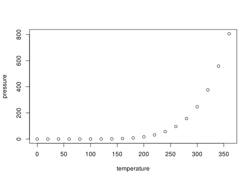

# Goalzone Fitness Class: Predict the Attendance of Members


## Company Description

GoalZone is a fitness club chain providing fitness classes in Canada. Finally, the fitness classes schedule is back to normal after the COVID-19 restrictions are lifted. However, they have received many complaints from the customers about having a hard time booking a fitness class.

**The Problem**: Some classes are always fully booked, and fully booked classes often have a low attendance rate.

Goalzone wants to increase the number of spaces available for classes. They want to do this by predicting whether the member will attend the class or not. If they can predict a member will not attend the class, they can make another space available

## Customer Question

-   The operation manager has asked to answer the following: - Can you predict the member that will attend a class or not?

## Dataset

The dataset contains the attendance information for the class scheduled this year so far. The data comes from DataCamp as a part of their Data Science Certificate Project.

| Column Name      | Criteria                                                                                                                                                            |
|--------------------------------|----------------------------------------|
| booking_id       | Nominal. The unique identifier of the booking. Missing values are not possible due to the database structure.                                                       |
| months_as_member | Discrete. The number of months as this fitness club member, minimum 1 month. Replace missing values with the overall average month.                                 |
| weight           | Continuous. The member's weight in kg, rounded to 2 decimal places. The minimum possible value is 40.00 kg. Replace missing values with the overall average weight. |
| days_before      | Discrete. The number of days before the class the member registered, minimum 1 day. Replace missing values with 0.                                                  |
| day_of_week      | Nominal. The day of the week of the class. One of "Mon", "Tue", "Wed", "Thu", "Fri", "Sat" or "Sun". Replace missing values with "unknown".                         |
| time             | Ordinal. The time of day of the class. Either "AM" or "PM". Replace missing values with "unknown".                                                                  |
| category         | Nominal. The category of the fitness class. One of "Yoga", "Aqua", "Strength", "HIIT", or "Cycling". Replace missing values with "unknown".                         |
| attended         | Nominal. Whether the member attended the class (1) or not (0). Missing values should be removed.                                                                    |

Load libraries, import data and preview data


```r
library(tidyverse)
library(ggthemes)
library(rsample)
library(pROC)
library(rpart)
library(rpart.plot)

# Import data
goalzone_fc <- read_csv("https://raw.githubusercontent.com/xrander/fitness_class_project/master/fitness_class_2212.csv")
```


```r
goalzone_fc #view document
```

<div data-pagedtable="false">
  <script data-pagedtable-source type="application/json">
{"columns":[{"label":["booking_id"],"name":[1],"type":["chr"],"align":["left"]},{"label":["months_as_member"],"name":[2],"type":["dbl"],"align":["right"]},{"label":["weight"],"name":[3],"type":["dbl"],"align":["right"]},{"label":["days_before"],"name":[4],"type":["chr"],"align":["left"]},{"label":["day_of_week"],"name":[5],"type":["chr"],"align":["left"]},{"label":["time"],"name":[6],"type":["chr"],"align":["left"]},{"label":["category"],"name":[7],"type":["chr"],"align":["left"]},{"label":["attended"],"name":[8],"type":["dbl"],"align":["right"]}],"data":[{"1":"0001","2":"17","3":"79.56","4":"8","5":"Wed","6":"PM","7":"Strength","8":"0"},{"1":"0002","2":"10","3":"79.01","4":"2","5":"Mon","6":"AM","7":"HIIT","8":"0"},{"1":"0003","2":"16","3":"74.53","4":"14","5":"Sun","6":"AM","7":"Strength","8":"0"},{"1":"0004","2":"5","3":"86.12","4":"10","5":"Fri","6":"AM","7":"Cycling","8":"0"},{"1":"0005","2":"15","3":"69.29","4":"8","5":"Thu","6":"AM","7":"HIIT","8":"0"},{"1":"0006","2":"7","3":"93.33","4":"2","5":"Mon","6":"AM","7":"Cycling","8":"0"},{"1":"0007","2":"11","3":"88.59","4":"6","5":"Wednesday","6":"PM","7":"HIIT","8":"0"},{"1":"0008","2":"9","3":"89.52","4":"10","5":"Fri","6":"AM","7":"HIIT","8":"0"},{"1":"0009","2":"23","3":"71.12","4":"10","5":"Fri.","6":"AM","7":"HIIT","8":"1"},{"1":"0010","2":"7","3":"81.25","4":"10","5":"Fri","6":"AM","7":"HIIT","8":"0"},{"1":"0011","2":"13","3":"73.22","4":"4","5":"Tue","6":"AM","7":"Cycling","8":"0"},{"1":"0012","2":"16","3":"86.86","4":"10","5":"Fri","6":"AM","7":"Cycling","8":"0"},{"1":"0013","2":"16","3":"71.70","4":"14","5":"Sun","6":"AM","7":"Strength","8":"1"},{"1":"0014","2":"8","3":"81.32","4":"4","5":"Tue","6":"AM","7":"Cycling","8":"0"},{"1":"0015","2":"9","3":"77.35","4":"10","5":"Fri","6":"AM","7":"Cycling","8":"0"},{"1":"0016","2":"9","3":"82.42","4":"14","5":"Sun","6":"AM","7":"HIIT","8":"1"},{"1":"0017","2":"22","3":"69.52","4":"14","5":"Sun","6":"AM","7":"Strength","8":"1"},{"1":"0018","2":"6","3":"79.01","4":"9","5":"Thu","6":"PM","7":"Yoga","8":"0"},{"1":"0019","2":"33","3":"81.55","4":"8","5":"Thu","6":"AM","7":"Cycling","8":"1"},{"1":"0020","2":"10","3":"72.93","4":"4","5":"Tue","6":"AM","7":"Cycling","8":"1"},{"1":"0021","2":"24","3":"68.35","4":"12","5":"Sat","6":"PM","7":"Strength","8":"1"},{"1":"0022","2":"14","3":"94.72","4":"2","5":"Mon","6":"AM","7":"Cycling","8":"1"},{"1":"0023","2":"2","3":"92.87","4":"10","5":"Fri","6":"AM","7":"Strength","8":"0"},{"1":"0024","2":"12","3":"91.74","4":"10","5":"Fri","6":"AM","7":"Strength","8":"0"},{"1":"0025","2":"8","3":"92.24","4":"2","5":"Mon","6":"AM","7":"Strength","8":"0"},{"1":"0026","2":"2","3":"85.67","4":"2","5":"Mon","6":"AM","7":"HIIT","8":"0"},{"1":"0027","2":"12","3":"76.56","4":"2","5":"Mon","6":"AM","7":"HIIT","8":"1"},{"1":"0028","2":"26","3":"82.87","4":"4","5":"Tue","6":"PM","7":"HIIT","8":"0"},{"1":"0029","2":"28","3":"87.19","4":"2","5":"Mon","6":"AM","7":"Strength","8":"1"},{"1":"0030","2":"27","3":"98.91","4":"12","5":"Sat","6":"AM","7":"Yoga","8":"1"},{"1":"0031","2":"8","3":"79.96","4":"4","5":"Tue","6":"AM","7":"HIIT","8":"1"},{"1":"0032","2":"8","3":"84.87","4":"2","5":"Mon","6":"AM","7":"Strength","8":"0"},{"1":"0033","2":"1","3":"88.75","4":"4","5":"Tue","6":"AM","7":"Cycling","8":"0"},{"1":"0034","2":"6","3":"86.67","4":"10","5":"Fri","6":"AM","7":"Yoga","8":"0"},{"1":"0035","2":"3","3":"81.58","4":"10","5":"Fri","6":"AM","7":"HIIT","8":"0"},{"1":"0036","2":"6","3":"83.13","4":"9","5":"Thu","6":"PM","7":"Cycling","8":"0"},{"1":"0037","2":"24","3":"73.49","4":"4","5":"Tue","6":"AM","7":"Strength","8":"1"},{"1":"0038","2":"8","3":"79.36","4":"12","5":"Sat","6":"AM","7":"HIIT","8":"0"},{"1":"0039","2":"27","3":"78.81","4":"10","5":"Fri","6":"AM","7":"HIIT","8":"1"},{"1":"0040","2":"7","3":"97.26","4":"10","5":"Fri","6":"AM","7":"HIIT","8":"0"},{"1":"0041","2":"5","3":"93.33","4":"14","5":"Sun","6":"AM","7":"HIIT","8":"0"},{"1":"0042","2":"14","3":"83.16","4":"10","5":"Thu","6":"PM","7":"Strength","8":"0"},{"1":"0043","2":"7","3":"90.00","4":"14","5":"Sun","6":"PM","7":"Cycling","8":"0"},{"1":"0044","2":"9","3":"112.15","4":"10","5":"Fri","6":"AM","7":"HIIT","8":"0"},{"1":"0045","2":"6","3":"108.20","4":"8","5":"Wed","6":"PM","7":"Strength","8":"0"},{"1":"0046","2":"5","3":"104.19","4":"2","5":"Mon","6":"AM","7":"HIIT","8":"0"},{"1":"0047","2":"21","3":"67.81","4":"4","5":"Tue","6":"PM","7":"HIIT","8":"0"},{"1":"0048","2":"17","3":"81.98","4":"2","5":"Mon","6":"AM","7":"HIIT","8":"0"},{"1":"0049","2":"10","3":"81.56","4":"14","5":"Sun","6":"AM","7":"Strength","8":"0"},{"1":"0050","2":"18","3":"79.57","4":"2","5":"Mon","6":"AM","7":"Strength","8":"0"},{"1":"0051","2":"8","3":"85.39","4":"8","5":"Thu","6":"AM","7":"Yoga","8":"0"},{"1":"0052","2":"19","3":"69.65","4":"2","5":"Mon","6":"AM","7":"Yoga","8":"0"},{"1":"0053","2":"12","3":"77.09","4":"10","5":"Fri","6":"AM","7":"HIIT","8":"0"},{"1":"0054","2":"19","3":"65.65","4":"4","5":"Tue","6":"AM","7":"HIIT","8":"1"},{"1":"0055","2":"53","3":"61.10","4":"10","5":"Fri.","6":"AM","7":"HIIT","8":"1"},{"1":"0056","2":"17","3":"71.35","4":"4","5":"Tue","6":"PM","7":"-","8":"0"},{"1":"0057","2":"3","3":"100.90","4":"10","5":"Fri","6":"AM","7":"HIIT","8":"0"},{"1":"0058","2":"12","3":"79.68","4":"2","5":"Mon","6":"AM","7":"HIIT","8":"0"},{"1":"0059","2":"19","3":"72.23","4":"10","5":"Fri.","6":"AM","7":"Yoga","8":"0"},{"1":"0060","2":"16","3":"67.53","4":"8","5":"Thu","6":"AM","7":"Yoga","8":"0"},{"1":"0061","2":"8","3":"101.32","4":"5","5":"Tue","6":"PM","7":"Yoga","8":"0"},{"1":"0062","2":"6","3":"81.44","4":"2","5":"Monday","6":"AM","7":"HIIT","8":"0"},{"1":"0063","2":"9","3":"76.05","4":"4","5":"Tue","6":"AM","7":"HIIT","8":"0"},{"1":"0064","2":"10","3":"100.44","4":"8","5":"Thu","6":"AM","7":"Aqua","8":"0"},{"1":"0065","2":"2","3":"107.03","4":"2","5":"Mon","6":"AM","7":"Yoga","8":"0"},{"1":"0066","2":"20","3":"76.07","4":"4","5":"Tue","6":"AM","7":"HIIT","8":"0"},{"1":"0067","2":"11","3":"71.54","4":"8","5":"Thu","6":"AM","7":"Strength","8":"0"},{"1":"0068","2":"8","3":"72.63","4":"14","5":"Sun","6":"PM","7":"Strength","8":"1"},{"1":"0069","2":"9","3":"82.13","4":"10","5":"Thu","6":"PM","7":"HIIT","8":"0"},{"1":"0070","2":"2","3":"108.82","4":"10","5":"Fri","6":"AM","7":"HIIT","8":"0"},{"1":"0071","2":"17","3":"74.57","4":"3","5":"Mon","6":"AM","7":"Cycling","8":"0"},{"1":"0072","2":"11","3":"74.75","4":"10","5":"Fri","6":"AM","7":"HIIT","8":"0"},{"1":"0073","2":"8","3":"85.86","4":"7","5":"Wednesday","6":"PM","7":"HIIT","8":"0"},{"1":"0074","2":"28","3":"73.78","4":"5","5":"Wed","6":"PM","7":"HIIT","8":"1"},{"1":"0075","2":"34","3":"75.34","4":"10","5":"Fri","6":"AM","7":"Cycling","8":"0"},{"1":"0076","2":"20","3":"60.10","4":"2","5":"Mon","6":"AM","7":"Aqua","8":"0"},{"1":"0077","2":"5","3":"94.70","4":"6","5":"Wed","6":"AM","7":"HIIT","8":"0"},{"1":"0078","2":"12","3":"97.11","4":"8","5":"Thu","6":"AM","7":"HIIT","8":"1"},{"1":"0079","2":"14","3":"69.00","4":"14","5":"Sun","6":"AM","7":"Cycling","8":"1"},{"1":"0080","2":"11","3":"82.16","4":"13","5":"Sat","6":"AM","7":"Yoga","8":"0"},{"1":"0081","2":"10","3":"94.97","4":"8","5":"Thu","6":"AM","7":"Cycling","8":"0"},{"1":"0082","2":"11","3":"85.79","4":"8","5":"Thu","6":"PM","7":"Yoga","8":"0"},{"1":"0083","2":"6","3":"117.19","4":"10","5":"Fri","6":"AM","7":"HIIT","8":"0"},{"1":"0084","2":"25","3":"70.80","4":"13","5":"Sat","6":"PM","7":"HIIT","8":"1"},{"1":"0085","2":"9","3":"74.76","4":"8","5":"Thu","6":"AM","7":"HIIT","8":"0"},{"1":"0086","2":"8","3":"80.34","4":"10","5":"Fri","6":"AM","7":"HIIT","8":"0"},{"1":"0087","2":"17","3":"86.53","4":"7","5":"Thu","6":"PM","7":"Cycling","8":"0"},{"1":"0088","2":"20","3":"80.11","4":"10","5":"Fri.","6":"AM","7":"Yoga","8":"1"},{"1":"0089","2":"14","3":"68.96","4":"14","5":"Sun","6":"AM","7":"Aqua","8":"0"},{"1":"0090","2":"32","3":"77.57","4":"6","5":"Wed","6":"AM","7":"Cycling","8":"0"},{"1":"0091","2":"3","3":"112.47","4":"10","5":"Fri","6":"AM","7":"Strength","8":"0"},{"1":"0092","2":"27","3":"77.39","4":"8","5":"Thu","6":"AM","7":"Strength","8":"1"},{"1":"0093","2":"73","3":"66.00","4":"8","5":"Thu","6":"AM","7":"HIIT","8":"1"},{"1":"0094","2":"10","3":"79.32","4":"12 days","5":"Sat","6":"AM","7":"HIIT","8":"1"},{"1":"0095","2":"5","3":"90.06","4":"6","5":"Wednesday","6":"AM","7":"Cycling","8":"0"},{"1":"0096","2":"20","3":"75.34","4":"10","5":"Thu","6":"PM","7":"Cycling","8":"1"},{"1":"0097","2":"7","3":"81.69","4":"12","5":"Sat","6":"AM","7":"Cycling","8":"1"},{"1":"0098","2":"6","3":"80.74","4":"8","5":"Thu","6":"PM","7":"HIIT","8":"0"},{"1":"0099","2":"55","3":"62.92","4":"6","5":"Wed","6":"PM","7":"Cycling","8":"1"},{"1":"0100","2":"4","3":"113.86","4":"4","5":"Tue","6":"AM","7":"HIIT","8":"0"},{"1":"0101","2":"9","3":"73.07","4":"8","5":"Thu","6":"AM","7":"HIIT","8":"0"},{"1":"0102","2":"7","3":"84.72","4":"12","5":"Sat","6":"AM","7":"Strength","8":"0"},{"1":"0103","2":"14","3":"80.76","4":"14","5":"Sun","6":"AM","7":"Strength","8":"0"},{"1":"0104","2":"11","3":"85.41","4":"2","5":"Mon","6":"AM","7":"HIIT","8":"1"},{"1":"0105","2":"9","3":"92.06","4":"2","5":"Mon","6":"AM","7":"HIIT","8":"0"},{"1":"0106","2":"5","3":"78.28","4":"2","5":"Mon","6":"AM","7":"HIIT","8":"0"},{"1":"0107","2":"12","3":"79.77","4":"2","5":"Monday","6":"AM","7":"Strength","8":"0"},{"1":"0108","2":"8","3":"71.49","4":"10","5":"Fri","6":"AM","7":"HIIT","8":"0"},{"1":"0109","2":"21","3":"76.77","4":"8","5":"Thu","6":"AM","7":"Cycling","8":"0"},{"1":"0110","2":"14","3":"69.35","4":"20","5":"Sun","6":"PM","7":"HIIT","8":"1"},{"1":"0111","2":"11","3":"74.57","4":"14","5":"Sun","6":"PM","7":"Strength","8":"0"},{"1":"0112","2":"34","3":"64.52","4":"14","5":"Sun","6":"AM","7":"Yoga","8":"1"},{"1":"0113","2":"8","3":"81.06","4":"4","5":"Tue","6":"PM","7":"HIIT","8":"0"},{"1":"0114","2":"12","3":"79.79","4":"2","5":"Mon","6":"AM","7":"HIIT","8":"0"},{"1":"0115","2":"14","3":"NA","4":"10","5":"Fri","6":"AM","7":"HIIT","8":"0"},{"1":"0116","2":"27","3":"83.32","4":"8","5":"Thu","6":"AM","7":"Yoga","8":"1"},{"1":"0117","2":"10","3":"97.13","4":"1","5":"Mon","6":"PM","7":"HIIT","8":"0"},{"1":"0118","2":"18","3":"88.77","4":"14","5":"Sun","6":"AM","7":"Cycling","8":"1"},{"1":"0119","2":"13","3":"90.38","4":"2","5":"Mon","6":"AM","7":"Yoga","8":"1"},{"1":"0120","2":"26","3":"65.88","4":"2","5":"Mon","6":"AM","7":"HIIT","8":"0"},{"1":"0121","2":"35","3":"69.41","4":"4","5":"Tue","6":"AM","7":"HIIT","8":"1"},{"1":"0122","2":"54","3":"73.02","4":"7","5":"Wednesday","6":"AM","7":"HIIT","8":"1"},{"1":"0123","2":"6","3":"98.42","4":"10","5":"Fri","6":"AM","7":"HIIT","8":"0"},{"1":"0124","2":"15","3":"71.99","4":"10","5":"Fri","6":"AM","7":"HIIT","8":"0"},{"1":"0125","2":"76","3":"58.68","4":"15","5":"Sun","6":"PM","7":"HIIT","8":"1"},{"1":"0126","2":"3","3":"97.38","4":"2","5":"Mon","6":"AM","7":"Cycling","8":"0"},{"1":"0127","2":"15","3":"75.70","4":"2","5":"Mon","6":"AM","7":"Cycling","8":"0"},{"1":"0128","2":"3","3":"86.92","4":"8","5":"Thu","6":"AM","7":"Cycling","8":"0"},{"1":"0129","2":"28","3":"70.77","4":"12","5":"Sat","6":"AM","7":"HIIT","8":"1"},{"1":"0130","2":"8","3":"104.33","4":"14","5":"Sun","6":"AM","7":"HIIT","8":"0"},{"1":"0131","2":"5","3":"81.42","4":"14","5":"Sun","6":"AM","7":"HIIT","8":"0"},{"1":"0132","2":"11","3":"77.56","4":"7","5":"Thu","6":"PM","7":"HIIT","8":"0"},{"1":"0133","2":"9","3":"109.23","4":"2","5":"Mon","6":"AM","7":"HIIT","8":"0"},{"1":"0134","2":"11","3":"97.77","4":"14","5":"Sun","6":"AM","7":"HIIT","8":"0"},{"1":"0135","2":"9","3":"85.32","4":"8","5":"Thu","6":"AM","7":"Cycling","8":"0"},{"1":"0136","2":"24","3":"80.01","4":"2","5":"Mon","6":"AM","7":"HIIT","8":"1"},{"1":"0137","2":"10","3":"73.38","4":"10","5":"Fri","6":"AM","7":"HIIT","8":"0"},{"1":"0138","2":"13","3":"95.97","4":"2","5":"Mon","6":"AM","7":"Cycling","8":"0"},{"1":"0139","2":"62","3":"57.83","4":"2","5":"Mon","6":"AM","7":"HIIT","8":"1"},{"1":"0140","2":"5","3":"89.67","4":"15","5":"Sun","6":"AM","7":"HIIT","8":"0"},{"1":"0141","2":"42","3":"59.97","4":"10","5":"Fri","6":"AM","7":"Yoga","8":"1"},{"1":"0142","2":"21","3":"73.99","4":"10","5":"Fri.","6":"AM","7":"Yoga","8":"1"},{"1":"0143","2":"11","3":"55.41","4":"10","5":"Fri","6":"AM","7":"HIIT","8":"0"},{"1":"0144","2":"105","3":"66.07","4":"12","5":"Sat","6":"AM","7":"Cycling","8":"1"},{"1":"0145","2":"15","3":"78.07","4":"8","5":"Thu","6":"AM","7":"HIIT","8":"0"},{"1":"0146","2":"4","3":"109.09","4":"4","5":"Tue","6":"PM","7":"HIIT","8":"0"},{"1":"0147","2":"20","3":"81.06","4":"2","5":"Mon","6":"AM","7":"Cycling","8":"1"},{"1":"0148","2":"24","3":"62.76","4":"7","5":"Wed","6":"PM","7":"HIIT","8":"0"},{"1":"0149","2":"2","3":"108.13","4":"14","5":"Sun","6":"AM","7":"HIIT","8":"0"},{"1":"0150","2":"5","3":"94.46","4":"14","5":"Sun","6":"AM","7":"Strength","8":"0"},{"1":"0151","2":"90","3":"58.13","4":"14","5":"Sun","6":"AM","7":"HIIT","8":"1"},{"1":"0152","2":"15","3":"66.24","4":"8","5":"Thu","6":"AM","7":"HIIT","8":"0"},{"1":"0153","2":"29","3":"68.84","4":"4","5":"Tue","6":"PM","7":"Strength","8":"1"},{"1":"0154","2":"8","3":"77.16","4":"12","5":"Fri","6":"PM","7":"HIIT","8":"0"},{"1":"0155","2":"18","3":"82.93","4":"12","5":"Sat","6":"AM","7":"HIIT","8":"0"},{"1":"0156","2":"60","3":"68.02","4":"12","5":"Sat","6":"AM","7":"Cycling","8":"1"},{"1":"0157","2":"3","3":"112.22","4":"12","5":"Sat","6":"AM","7":"HIIT","8":"0"},{"1":"0158","2":"16","3":"88.34","4":"2","5":"Mon","6":"AM","7":"Strength","8":"1"},{"1":"0159","2":"7","3":"83.26","4":"3","5":"Tue","6":"PM","7":"Cycling","8":"0"},{"1":"0160","2":"21","3":"83.77","4":"8","5":"Thu","6":"AM","7":"HIIT","8":"0"},{"1":"0161","2":"21","3":"63.04","4":"2","5":"Mon","6":"AM","7":"HIIT","8":"0"},{"1":"0162","2":"3","3":"110.18","4":"8","5":"Thu","6":"PM","7":"Strength","8":"0"},{"1":"0163","2":"3","3":"98.53","4":"8","5":"Thu","6":"PM","7":"HIIT","8":"0"},{"1":"0164","2":"12","3":"65.51","4":"4","5":"Tue","6":"AM","7":"HIIT","8":"0"},{"1":"0165","2":"11","3":"72.21","4":"13","5":"Sat","6":"PM","7":"HIIT","8":"0"},{"1":"0166","2":"9","3":"83.07","4":"2","5":"Mon","6":"AM","7":"Strength","8":"0"},{"1":"0167","2":"18","3":"99.91","4":"12","5":"Sat","6":"AM","7":"Strength","8":"1"},{"1":"0168","2":"7","3":"90.73","4":"8","5":"Thu","6":"AM","7":"Cycling","8":"0"},{"1":"0169","2":"30","3":"78.41","4":"12","5":"Sat","6":"AM","7":"HIIT","8":"1"},{"1":"0170","2":"9","3":"73.58","4":"8","5":"Thu","6":"AM","7":"Strength","8":"0"},{"1":"0171","2":"6","3":"111.44","4":"10","5":"Fri","6":"AM","7":"Aqua","8":"0"},{"1":"0172","2":"8","3":"89.62","4":"12","5":"Sat","6":"AM","7":"Strength","8":"0"},{"1":"0173","2":"11","3":"63.69","4":"4","5":"Tue","6":"AM","7":"HIIT","8":"0"},{"1":"0174","2":"13","3":"87.31","4":"12","5":"Sat","6":"AM","7":"Strength","8":"0"},{"1":"0175","2":"25","3":"80.15","4":"10","5":"Fri","6":"AM","7":"Cycling","8":"0"},{"1":"0176","2":"32","3":"84.76","4":"2","5":"Mon","6":"AM","7":"Cycling","8":"0"},{"1":"0177","2":"3","3":"105.88","4":"10","5":"Fri","6":"AM","7":"Strength","8":"0"},{"1":"0178","2":"11","3":"78.28","4":"12","5":"Sat","6":"AM","7":"HIIT","8":"0"},{"1":"0179","2":"12","3":"69.33","4":"4","5":"Tue","6":"AM","7":"Strength","8":"0"},{"1":"0180","2":"8","3":"82.63","4":"12","5":"Sat","6":"AM","7":"HIIT","8":"0"},{"1":"0181","2":"23","3":"90.78","4":"12","5":"Sat","6":"AM","7":"Cycling","8":"0"},{"1":"0182","2":"5","3":"99.45","4":"10","5":"Fri","6":"AM","7":"Aqua","8":"0"},{"1":"0183","2":"6","3":"82.54","4":"12","5":"Sat","6":"AM","7":"Strength","8":"0"},{"1":"0184","2":"107","3":"67.02","4":"4","5":"Tue","6":"PM","7":"HIIT","8":"1"},{"1":"0185","2":"52","3":"69.34","4":"10","5":"Fri","6":"AM","7":"HIIT","8":"1"},{"1":"0186","2":"8","3":"70.84","4":"12","5":"Sat","6":"AM","7":"HIIT","8":"0"},{"1":"0187","2":"8","3":"92.84","4":"10","5":"Fri","6":"AM","7":"Cycling","8":"0"},{"1":"0188","2":"34","3":"63.41","4":"8","5":"Thu","6":"AM","7":"Cycling","8":"0"},{"1":"0189","2":"13","3":"78.59","4":"2","5":"Mon","6":"AM","7":"Strength","8":"1"},{"1":"0190","2":"5","3":"71.74","4":"6 days","5":"Wed","6":"PM","7":"Strength","8":"0"},{"1":"0191","2":"14","3":"68.75","4":"3","5":"Mon","6":"AM","7":"Aqua","8":"1"},{"1":"0192","2":"53","3":"61.20","4":"4","5":"Tue","6":"AM","7":"HIIT","8":"1"},{"1":"0193","2":"17","3":"89.54","4":"12 days","5":"Sat","6":"AM","7":"HIIT","8":"0"},{"1":"0194","2":"37","3":"66.89","4":"10","5":"Fri","6":"AM","7":"Yoga","8":"1"},{"1":"0195","2":"8","3":"72.56","4":"2","5":"Mon","6":"AM","7":"Strength","8":"0"},{"1":"0196","2":"11","3":"70.91","4":"4","5":"Tue","6":"PM","7":"Aqua","8":"0"},{"1":"0197","2":"15","3":"79.02","4":"12","5":"Sat","6":"AM","7":"Strength","8":"0"},{"1":"0198","2":"37","3":"73.32","4":"2","5":"Mon","6":"AM","7":"Strength","8":"1"},{"1":"0199","2":"8","3":"98.92","4":"10","5":"Fri","6":"AM","7":"Aqua","8":"0"},{"1":"0200","2":"12","3":"80.28","4":"14","5":"Sun","6":"AM","7":"Cycling","8":"0"},{"1":"0201","2":"22","3":"88.90","4":"4","5":"Tue","6":"AM","7":"Yoga","8":"1"},{"1":"0202","2":"9","3":"83.21","4":"12","5":"Sat","6":"AM","7":"HIIT","8":"0"},{"1":"0203","2":"6","3":"97.94","4":"7","5":"Thu","6":"PM","7":"Cycling","8":"0"},{"1":"0204","2":"15","3":"104.16","4":"11","5":"Fri","6":"AM","7":"HIIT","8":"0"},{"1":"0205","2":"10","3":"110.54","4":"2","5":"Mon","6":"AM","7":"HIIT","8":"0"},{"1":"0206","2":"6","3":"91.52","4":"10","5":"Fri","6":"AM","7":"HIIT","8":"0"},{"1":"0207","2":"38","3":"85.69","4":"6","5":"Wed","6":"AM","7":"HIIT","8":"1"},{"1":"0208","2":"10","3":"100.37","4":"12","5":"Sat","6":"PM","7":"HIIT","8":"0"},{"1":"0209","2":"35","3":"72.70","4":"10","5":"Fri","6":"AM","7":"Cycling","8":"1"},{"1":"0210","2":"10","3":"93.92","4":"11","5":"Sat","6":"PM","7":"Yoga","8":"0"},{"1":"0211","2":"19","3":"98.71","4":"14","5":"Sun","6":"AM","7":"HIIT","8":"0"},{"1":"0212","2":"16","3":"NA","4":"10","5":"Fri","6":"AM","7":"Cycling","8":"0"},{"1":"0213","2":"10","3":"84.10","4":"14","5":"Sun","6":"AM","7":"HIIT","8":"0"},{"1":"0214","2":"9","3":"77.48","4":"2","5":"Mon","6":"AM","7":"Cycling","8":"0"},{"1":"0215","2":"16","3":"67.38","4":"2","5":"Mon","6":"AM","7":"HIIT","8":"0"},{"1":"0216","2":"8","3":"84.49","4":"10","5":"Fri","6":"AM","7":"Yoga","8":"0"},{"1":"0217","2":"12","3":"74.04","4":"4","5":"Tue","6":"AM","7":"Aqua","8":"0"},{"1":"0218","2":"21","3":"69.00","4":"4","5":"Tue","6":"PM","7":"Yoga","8":"1"},{"1":"0219","2":"13","3":"72.34","4":"12","5":"Sat","6":"AM","7":"HIIT","8":"0"},{"1":"0220","2":"3","3":"90.91","4":"8","5":"Thu","6":"AM","7":"Cycling","8":"0"},{"1":"0221","2":"27","3":"68.72","4":"12","5":"Sat","6":"AM","7":"Strength","8":"1"},{"1":"0222","2":"17","3":"74.87","4":"2","5":"Mon","6":"AM","7":"HIIT","8":"1"},{"1":"0223","2":"20","3":"66.15","4":"10","5":"Fri","6":"AM","7":"HIIT","8":"1"},{"1":"0224","2":"48","3":"68.39","4":"10","5":"Fri.","6":"AM","7":"HIIT","8":"1"},{"1":"0225","2":"21","3":"83.07","4":"14","5":"Sun","6":"AM","7":"Strength","8":"1"},{"1":"0226","2":"51","3":"63.59","4":"8","5":"Thu","6":"AM","7":"HIIT","8":"1"},{"1":"0227","2":"13","3":"72.58","4":"12","5":"Sat","6":"AM","7":"Strength","8":"0"},{"1":"0228","2":"20","3":"68.70","4":"8","5":"Thu","6":"AM","7":"Cycling","8":"1"},{"1":"0229","2":"12","3":"84.45","4":"13","5":"Sat","6":"AM","7":"Strength","8":"0"},{"1":"0230","2":"23","3":"71.00","4":"6","5":"Wednesday","6":"AM","7":"Cycling","8":"0"},{"1":"0231","2":"12","3":"88.42","4":"9","5":"Thu","6":"AM","7":"Yoga","8":"0"},{"1":"0232","2":"10","3":"81.69","4":"8","5":"Thu","6":"AM","7":"HIIT","8":"0"},{"1":"0233","2":"18","3":"80.93","4":"2","5":"Mon","6":"AM","7":"Aqua","8":"0"},{"1":"0234","2":"8","3":"85.12","4":"6","5":"Wednesday","6":"AM","7":"HIIT","8":"1"},{"1":"0235","2":"16","3":"76.12","4":"8","5":"Thu","6":"AM","7":"Strength","8":"0"},{"1":"0236","2":"8","3":"90.12","4":"12","5":"Sat","6":"AM","7":"HIIT","8":"0"},{"1":"0237","2":"17","3":"76.61","4":"13 days","5":"Sat","6":"AM","7":"Cycling","8":"1"},{"1":"0238","2":"29","3":"68.31","4":"2","5":"Monday","6":"AM","7":"Yoga","8":"1"},{"1":"0239","2":"10","3":"74.35","4":"3 days","5":"Tue","6":"PM","7":"HIIT","8":"0"},{"1":"0240","2":"9","3":"75.63","4":"12","5":"Sat","6":"AM","7":"HIIT","8":"0"},{"1":"0241","2":"10","3":"77.81","4":"5","5":"Tue","6":"PM","7":"Cycling","8":"1"},{"1":"0242","2":"7","3":"79.38","4":"14","5":"Sun","6":"AM","7":"HIIT","8":"0"},{"1":"0243","2":"16","3":"87.55","4":"8","5":"Thu","6":"PM","7":"Cycling","8":"0"},{"1":"0244","2":"7","3":"89.94","4":"8","5":"Thu","6":"AM","7":"HIIT","8":"0"},{"1":"0245","2":"34","3":"68.83","4":"10","5":"Fri","6":"AM","7":"Yoga","8":"1"},{"1":"0246","2":"9","3":"82.29","4":"2","5":"Mon","6":"PM","7":"Cycling","8":"0"},{"1":"0247","2":"12","3":"82.89","4":"12","5":"Sat","6":"AM","7":"HIIT","8":"0"},{"1":"0248","2":"12","3":"77.03","4":"10","5":"Fri","6":"AM","7":"HIIT","8":"0"},{"1":"0249","2":"7","3":"86.31","4":"10","5":"Fri","6":"AM","7":"Cycling","8":"0"},{"1":"0250","2":"40","3":"68.70","4":"14","5":"Sun","6":"AM","7":"Cycling","8":"1"},{"1":"0251","2":"4","3":"86.74","4":"2","5":"Mon","6":"AM","7":"Cycling","8":"0"},{"1":"0252","2":"8","3":"92.40","4":"2","5":"Mon","6":"AM","7":"Aqua","8":"1"},{"1":"0253","2":"8","3":"86.15","4":"2","5":"Mon","6":"AM","7":"HIIT","8":"0"},{"1":"0254","2":"3","3":"101.97","4":"12","5":"Sat","6":"AM","7":"Strength","8":"0"},{"1":"0255","2":"7","3":"105.20","4":"14","5":"Sun","6":"PM","7":"HIIT","8":"0"},{"1":"0256","2":"6","3":"78.32","4":"14","5":"Sun","6":"AM","7":"HIIT","8":"0"},{"1":"0257","2":"8","3":"82.16","4":"10","5":"Fri","6":"AM","7":"Strength","8":"0"},{"1":"0258","2":"5","3":"80.71","4":"10","5":"Fri","6":"AM","7":"Strength","8":"0"},{"1":"0259","2":"25","3":"75.26","4":"14","5":"Sun","6":"AM","7":"HIIT","8":"1"},{"1":"0260","2":"20","3":"78.70","4":"12","5":"Sat","6":"AM","7":"Cycling","8":"1"},{"1":"0261","2":"15","3":"76.31","4":"12","5":"Sat","6":"AM","7":"Strength","8":"0"},{"1":"0262","2":"16","3":"82.66","4":"10","5":"Fri","6":"AM","7":"Aqua","8":"0"},{"1":"0263","2":"8","3":"81.45","4":"4","5":"Tue","6":"AM","7":"Cycling","8":"0"},{"1":"0264","2":"13","3":"82.28","4":"12","5":"Sat","6":"AM","7":"Strength","8":"0"},{"1":"0265","2":"6","3":"79.90","4":"12","5":"Sat","6":"AM","7":"Yoga","8":"0"},{"1":"0266","2":"12","3":"78.05","4":"2","5":"Mon","6":"AM","7":"Aqua","8":"0"},{"1":"0267","2":"4","3":"103.25","4":"14","5":"Sun","6":"AM","7":"HIIT","8":"0"},{"1":"0268","2":"4","3":"86.88","4":"4","5":"Tue","6":"AM","7":"HIIT","8":"0"},{"1":"0269","2":"7","3":"103.46","4":"12","5":"Sat","6":"AM","7":"Cycling","8":"0"},{"1":"0270","2":"4","3":"75.82","4":"10","5":"Fri","6":"AM","7":"Cycling","8":"0"},{"1":"0271","2":"3","3":"97.88","4":"4","5":"Tue","6":"AM","7":"Aqua","8":"0"},{"1":"0272","2":"13","3":"77.83","4":"2","5":"Mon","6":"AM","7":"Aqua","8":"0"},{"1":"0273","2":"6","3":"89.99","4":"8","5":"Thu","6":"PM","7":"Yoga","8":"0"},{"1":"0274","2":"25","3":"82.15","4":"10","5":"Fri","6":"AM","7":"Cycling","8":"0"},{"1":"0275","2":"20","3":"70.41","4":"8","5":"Thu","6":"AM","7":"Aqua","8":"0"},{"1":"0276","2":"7","3":"82.81","4":"16","5":"Sun","6":"PM","7":"HIIT","8":"0"},{"1":"0277","2":"17","3":"59.56","4":"10","5":"Fri.","6":"AM","7":"Cycling","8":"1"},{"1":"0278","2":"26","3":"74.57","4":"2","5":"Mon","6":"AM","7":"HIIT","8":"1"},{"1":"0279","2":"3","3":"86.08","4":"2","5":"Mon","6":"AM","7":"HIIT","8":"0"},{"1":"0280","2":"21","3":"66.49","4":"6","5":"Wed","6":"AM","7":"Cycling","8":"0"},{"1":"0281","2":"9","3":"93.47","4":"8","5":"Thu","6":"PM","7":"Strength","8":"0"},{"1":"0282","2":"12","3":"73.88","4":"10","5":"Fri","6":"AM","7":"HIIT","8":"0"},{"1":"0283","2":"14","3":"88.33","4":"12","5":"Sat","6":"AM","7":"HIIT","8":"0"},{"1":"0284","2":"8","3":"79.42","4":"7","5":"Thu","6":"PM","7":"Cycling","8":"0"},{"1":"0285","2":"26","3":"74.46","4":"10","5":"Fri","6":"AM","7":"HIIT","8":"0"},{"1":"0286","2":"89","3":"73.41","4":"8","5":"Thu","6":"AM","7":"HIIT","8":"1"},{"1":"0287","2":"24","3":"67.71","4":"12","5":"Sat","6":"AM","7":"Cycling","8":"1"},{"1":"0288","2":"13","3":"80.77","4":"12","5":"Sat","6":"AM","7":"Cycling","8":"1"},{"1":"0289","2":"10","3":"73.69","4":"6","5":"Wed","6":"PM","7":"Cycling","8":"0"},{"1":"0290","2":"22","3":"71.87","4":"4","5":"Tue","6":"AM","7":"HIIT","8":"1"},{"1":"0291","2":"9","3":"91.17","4":"7","5":"Wed","6":"PM","7":"Cycling","8":"0"},{"1":"0292","2":"26","3":"63.81","4":"12","5":"Sat","6":"AM","7":"Strength","8":"1"},{"1":"0293","2":"5","3":"114.17","4":"2","5":"Mon","6":"AM","7":"Strength","8":"0"},{"1":"0294","2":"57","3":"70.39","4":"14","5":"Sun","6":"AM","7":"Cycling","8":"1"},{"1":"0295","2":"11","3":"84.37","4":"2","5":"Mon","6":"AM","7":"Aqua","8":"1"},{"1":"0296","2":"34","3":"70.09","4":"4","5":"Tue","6":"AM","7":"HIIT","8":"1"},{"1":"0297","2":"20","3":"78.10","4":"12","5":"Sat","6":"AM","7":"Yoga","8":"1"},{"1":"0298","2":"13","3":"81.01","4":"6","5":"Wednesday","6":"PM","7":"Strength","8":"1"},{"1":"0299","2":"6","3":"87.32","4":"4","5":"Tue","6":"PM","7":"HIIT","8":"0"},{"1":"0300","2":"4","3":"71.49","4":"14","5":"Sun","6":"AM","7":"Strength","8":"0"},{"1":"0301","2":"7","3":"78.46","4":"6","5":"Wednesday","6":"AM","7":"HIIT","8":"0"},{"1":"0302","2":"11","3":"87.90","4":"4","5":"Tue","6":"AM","7":"HIIT","8":"1"},{"1":"0303","2":"9","3":"99.29","4":"8","5":"Thu","6":"AM","7":"Cycling","8":"0"},{"1":"0304","2":"9","3":"88.49","4":"12","5":"Sat","6":"AM","7":"HIIT","8":"1"},{"1":"0305","2":"12","3":"68.15","4":"2","5":"Mon","6":"AM","7":"HIIT","8":"0"},{"1":"0306","2":"10","3":"81.98","4":"15","5":"Sun","6":"PM","7":"HIIT","8":"0"},{"1":"0307","2":"36","3":"74.73","4":"10","5":"Fri","6":"AM","7":"HIIT","8":"1"},{"1":"0308","2":"13","3":"81.25","4":"4","5":"Tue","6":"AM","7":"HIIT","8":"0"},{"1":"0309","2":"13","3":"74.59","4":"3","5":"Tue","6":"PM","7":"Cycling","8":"1"},{"1":"0310","2":"7","3":"80.65","4":"12","5":"Sat","6":"AM","7":"HIIT","8":"0"},{"1":"0311","2":"13","3":"78.52","4":"13","5":"Sat","6":"AM","7":"Strength","8":"0"},{"1":"0312","2":"18","3":"66.05","4":"12","5":"Sat","6":"AM","7":"HIIT","8":"0"},{"1":"0313","2":"13","3":"95.72","4":"4","5":"Tue","6":"AM","7":"HIIT","8":"1"},{"1":"0314","2":"23","3":"94.94","4":"1 days","5":"Mon","6":"PM","7":"Cycling","8":"1"},{"1":"0315","2":"5","3":"90.51","4":"11","5":"Thu","6":"PM","7":"Yoga","8":"0"},{"1":"0316","2":"5","3":"NA","4":"14","5":"Sun","6":"AM","7":"HIIT","8":"0"},{"1":"0317","2":"11","3":"83.92","4":"10","5":"Fri","6":"AM","7":"Cycling","8":"0"},{"1":"0318","2":"15","3":"81.12","4":"12","5":"Sat","6":"AM","7":"Yoga","8":"0"},{"1":"0319","2":"20","3":"66.67","4":"10","5":"Fri","6":"AM","7":"HIIT","8":"0"},{"1":"0320","2":"12","3":"97.10","4":"7","5":"Wed","6":"PM","7":"HIIT","8":"1"},{"1":"0321","2":"14","3":"85.49","4":"4","5":"Tue","6":"AM","7":"HIIT","8":"0"},{"1":"0322","2":"20","3":"91.60","4":"8","5":"Thu","6":"AM","7":"Cycling","8":"0"},{"1":"0323","2":"14","3":"84.25","4":"8","5":"Thu","6":"AM","7":"Strength","8":"1"},{"1":"0324","2":"14","3":"83.35","4":"8","5":"Thu","6":"AM","7":"HIIT","8":"0"},{"1":"0325","2":"6","3":"111.16","4":"10","5":"Fri","6":"AM","7":"Cycling","8":"0"},{"1":"0326","2":"17","3":"77.19","4":"14","5":"Sun","6":"AM","7":"HIIT","8":"1"},{"1":"0327","2":"12","3":"100.05","4":"8","5":"Thu","6":"PM","7":"HIIT","8":"0"},{"1":"0328","2":"11","3":"69.73","4":"14","5":"Sun","6":"PM","7":"Cycling","8":"0"},{"1":"0329","2":"5","3":"76.93","4":"7","5":"Wed","6":"PM","7":"HIIT","8":"0"},{"1":"0330","2":"18","3":"75.16","4":"15","5":"Sun","6":"AM","7":"Cycling","8":"0"},{"1":"0331","2":"10","3":"70.61","4":"8","5":"Thu","6":"AM","7":"HIIT","8":"0"},{"1":"0332","2":"15","3":"71.06","4":"2","5":"Mon","6":"AM","7":"Yoga","8":"1"},{"1":"0333","2":"19","3":"70.68","4":"4","5":"Tue","6":"PM","7":"Cycling","8":"0"},{"1":"0334","2":"52","3":"83.20","4":"10","5":"Fri","6":"AM","7":"Cycling","8":"1"},{"1":"0335","2":"16","3":"87.00","4":"10","5":"Fri","6":"AM","7":"Yoga","8":"1"},{"1":"0336","2":"19","3":"67.86","4":"12","5":"Sat","6":"AM","7":"Strength","8":"0"},{"1":"0337","2":"11","3":"97.87","4":"5","5":"Tue","6":"PM","7":"Cycling","8":"0"},{"1":"0338","2":"14","3":"68.47","4":"14","5":"Sun","6":"AM","7":"HIIT","8":"0"},{"1":"0339","2":"13","3":"71.22","4":"3","5":"Mon","6":"AM","7":"Yoga","8":"0"},{"1":"0340","2":"7","3":"97.55","4":"13","5":"Wed","6":"PM","7":"Cycling","8":"0"},{"1":"0341","2":"6","3":"85.36","4":"14","5":"Sun","6":"AM","7":"HIIT","8":"0"},{"1":"0342","2":"13","3":"96.94","4":"10","5":"Fri","6":"AM","7":"HIIT","8":"0"},{"1":"0343","2":"27","3":"76.99","4":"12","5":"Sat","6":"AM","7":"Cycling","8":"1"},{"1":"0344","2":"23","3":"74.94","4":"12","5":"Sat","6":"AM","7":"Cycling","8":"1"},{"1":"0345","2":"20","3":"83.41","4":"14","5":"Sun","6":"AM","7":"Cycling","8":"1"},{"1":"0346","2":"19","3":"72.34","4":"8","5":"Thu","6":"AM","7":"Strength","8":"1"},{"1":"0347","2":"8","3":"75.14","4":"2","5":"Mon","6":"AM","7":"HIIT","8":"0"},{"1":"0348","2":"5","3":"112.86","4":"10","5":"Fri","6":"AM","7":"Cycling","8":"0"},{"1":"0349","2":"38","3":"72.88","4":"1","5":"Mon","6":"PM","7":"HIIT","8":"0"},{"1":"0350","2":"10","3":"88.28","4":"2","5":"Mon","6":"AM","7":"Yoga","8":"0"},{"1":"0351","2":"11","3":"79.68","4":"10","5":"Fri","6":"AM","7":"HIIT","8":"0"},{"1":"0352","2":"18","3":"81.20","4":"12","5":"Sat","6":"AM","7":"Cycling","8":"1"},{"1":"0353","2":"16","3":"79.57","4":"8","5":"Thu","6":"AM","7":"Cycling","8":"0"},{"1":"0354","2":"18","3":"78.63","4":"7","5":"Wed","6":"PM","7":"Cycling","8":"0"},{"1":"0355","2":"6","3":"93.79","4":"12","5":"Sat","6":"AM","7":"Strength","8":"0"},{"1":"0356","2":"38","3":"69.36","4":"4","5":"Tue","6":"AM","7":"Strength","8":"0"},{"1":"0357","2":"18","3":"73.05","4":"2","5":"Mon","6":"AM","7":"HIIT","8":"1"},{"1":"0358","2":"3","3":"86.50","4":"14","5":"Sun","6":"AM","7":"Cycling","8":"0"},{"1":"0359","2":"7","3":"81.54","4":"10","5":"Thu","6":"PM","7":"Cycling","8":"0"},{"1":"0360","2":"9","3":"77.71","4":"12","5":"Sat","6":"AM","7":"HIIT","8":"0"},{"1":"0361","2":"20","3":"81.53","4":"10","5":"Fri","6":"AM","7":"HIIT","8":"0"},{"1":"0362","2":"5","3":"88.39","4":"14","5":"Sun","6":"AM","7":"Strength","8":"0"},{"1":"0363","2":"5","3":"94.46","4":"2","5":"Mon","6":"AM","7":"HIIT","8":"0"},{"1":"0364","2":"7","3":"87.52","4":"6","5":"Wed","6":"PM","7":"Strength","8":"0"},{"1":"0365","2":"8","3":"80.72","4":"14","5":"Sun","6":"AM","7":"Cycling","8":"0"},{"1":"0366","2":"4","3":"88.17","4":"2","5":"Mon","6":"AM","7":"Cycling","8":"0"},{"1":"0367","2":"4","3":"NA","4":"2","5":"Mon","6":"AM","7":"Aqua","8":"0"},{"1":"0368","2":"14","3":"85.02","4":"4","5":"Tue","6":"PM","7":"Cycling","8":"0"},{"1":"0369","2":"2","3":"148.02","4":"8","5":"Thu","6":"AM","7":"HIIT","8":"0"},{"1":"0370","2":"13","3":"88.57","4":"12","5":"Sat","6":"AM","7":"Aqua","8":"1"},{"1":"0371","2":"6","3":"87.32","4":"14","5":"Sun","6":"PM","7":"HIIT","8":"0"},{"1":"0372","2":"14","3":"72.91","4":"12","5":"Sat","6":"AM","7":"Yoga","8":"1"},{"1":"0373","2":"7","3":"91.65","4":"14","5":"Sun","6":"AM","7":"Yoga","8":"0"},{"1":"0374","2":"9","3":"84.27","4":"2","5":"Mon","6":"AM","7":"Cycling","8":"0"},{"1":"0375","2":"10","3":"97.99","4":"10","5":"Fri","6":"AM","7":"Strength","8":"0"},{"1":"0376","2":"4","3":"90.56","4":"8","5":"Thu","6":"AM","7":"Strength","8":"0"},{"1":"0377","2":"14","3":"78.59","4":"14","5":"Sun","6":"AM","7":"HIIT","8":"0"},{"1":"0378","2":"12","3":"92.47","4":"6","5":"Tue","6":"PM","7":"Strength","8":"0"},{"1":"0379","2":"7","3":"97.56","4":"10","5":"Fri","6":"AM","7":"HIIT","8":"0"},{"1":"0380","2":"44","3":"69.88","4":"2","5":"Mon","6":"AM","7":"HIIT","8":"1"},{"1":"0381","2":"14","3":"77.98","4":"7 days","5":"Wed","6":"PM","7":"Strength","8":"0"},{"1":"0382","2":"13","3":"83.43","4":"2","5":"Mon","6":"AM","7":"Cycling","8":"1"},{"1":"0383","2":"6","3":"79.07","4":"4","5":"Tue","6":"AM","7":"HIIT","8":"0"},{"1":"0384","2":"8","3":"91.58","4":"8","5":"Thu","6":"AM","7":"HIIT","8":"0"},{"1":"0385","2":"29","3":"77.57","4":"2","5":"Mon","6":"PM","7":"Cycling","8":"1"},{"1":"0386","2":"11","3":"115.18","4":"2","5":"Mon","6":"AM","7":"Strength","8":"0"},{"1":"0387","2":"5","3":"91.47","4":"14","5":"Sun","6":"AM","7":"Strength","8":"0"},{"1":"0388","2":"10","3":"76.63","4":"6","5":"Wed","6":"PM","7":"Cycling","8":"0"},{"1":"0389","2":"7","3":"91.88","4":"12","5":"Sat","6":"AM","7":"HIIT","8":"1"},{"1":"0390","2":"21","3":"69.93","4":"10","5":"Fri","6":"AM","7":"HIIT","8":"0"},{"1":"0391","2":"8","3":"89.72","4":"10","5":"Fri","6":"AM","7":"Cycling","8":"0"},{"1":"0392","2":"4","3":"109.82","4":"10","5":"Fri","6":"AM","7":"HIIT","8":"0"},{"1":"0393","2":"7","3":"76.58","4":"2","5":"Mon","6":"AM","7":"HIIT","8":"0"},{"1":"0394","2":"8","3":"97.20","4":"11","5":"Sat","6":"PM","7":"Cycling","8":"0"},{"1":"0395","2":"6","3":"100.82","4":"14","5":"Sun","6":"AM","7":"Cycling","8":"0"},{"1":"0396","2":"13","3":"87.50","4":"4","5":"Tue","6":"AM","7":"HIIT","8":"0"},{"1":"0397","2":"26","3":"70.25","4":"8","5":"Thu","6":"AM","7":"HIIT","8":"0"},{"1":"0398","2":"20","3":"76.69","4":"8","5":"Thu","6":"AM","7":"Strength","8":"0"},{"1":"0399","2":"17","3":"67.71","4":"8 days","5":"Thu","6":"AM","7":"Cycling","8":"0"},{"1":"0400","2":"7","3":"90.14","4":"10","5":"Fri","6":"AM","7":"HIIT","8":"0"},{"1":"0401","2":"19","3":"70.41","4":"14","5":"Sun","6":"AM","7":"HIIT","8":"0"},{"1":"0402","2":"8","3":"73.98","4":"7","5":"Thu","6":"PM","7":"Cycling","8":"0"},{"1":"0403","2":"15","3":"71.29","4":"2","5":"Mon","6":"AM","7":"HIIT","8":"0"},{"1":"0404","2":"35","3":"63.28","4":"8","5":"Thu","6":"AM","7":"HIIT","8":"1"},{"1":"0405","2":"8","3":"84.64","4":"8","5":"Thu","6":"AM","7":"-","8":"0"},{"1":"0406","2":"10","3":"99.92","4":"10","5":"Fri","6":"AM","7":"Strength","8":"0"},{"1":"0407","2":"39","3":"81.53","4":"6","5":"Wed","6":"AM","7":"Yoga","8":"0"},{"1":"0408","2":"8","3":"89.14","4":"12","5":"Sat","6":"AM","7":"Cycling","8":"0"},{"1":"0409","2":"15","3":"86.09","4":"10","5":"Fri.","6":"AM","7":"HIIT","8":"0"},{"1":"0410","2":"10","3":"85.31","4":"12","5":"Sat","6":"PM","7":"HIIT","8":"0"},{"1":"0411","2":"6","3":"96.07","4":"8","5":"Thu","6":"AM","7":"Strength","8":"0"},{"1":"0412","2":"15","3":"96.49","4":"14","5":"Sun","6":"AM","7":"Yoga","8":"0"},{"1":"0413","2":"13","3":"81.79","4":"14","5":"Sun","6":"AM","7":"Cycling","8":"0"},{"1":"0414","2":"7","3":"86.70","4":"12","5":"Sat","6":"AM","7":"HIIT","8":"0"},{"1":"0415","2":"21","3":"87.43","4":"12","5":"Sat","6":"PM","7":"Strength","8":"0"},{"1":"0416","2":"9","3":"73.89","4":"12","5":"Sat","6":"AM","7":"Cycling","8":"0"},{"1":"0417","2":"6","3":"101.70","4":"5","5":"Tue","6":"PM","7":"Aqua","8":"0"},{"1":"0418","2":"8","3":"76.99","4":"4","5":"Tue","6":"AM","7":"HIIT","8":"0"},{"1":"0419","2":"14","3":"84.17","4":"14","5":"Sun","6":"AM","7":"HIIT","8":"1"},{"1":"0420","2":"11","3":"92.82","4":"8","5":"Thu","6":"PM","7":"HIIT","8":"0"},{"1":"0421","2":"10","3":"69.85","4":"2","5":"Mon","6":"AM","7":"Cycling","8":"0"},{"1":"0422","2":"5","3":"93.99","4":"14","5":"Sun","6":"AM","7":"Cycling","8":"0"},{"1":"0423","2":"13","3":"67.26","4":"10","5":"Fri","6":"AM","7":"Cycling","8":"0"},{"1":"0424","2":"41","3":"73.23","4":"14","5":"Sun","6":"AM","7":"Yoga","8":"1"},{"1":"0425","2":"20","3":"75.51","4":"4","5":"Tue","6":"AM","7":"HIIT","8":"0"},{"1":"0426","2":"15","3":"66.77","4":"4","5":"Tue","6":"AM","7":"Strength","8":"0"},{"1":"0427","2":"11","3":"78.77","4":"4","5":"Tue","6":"PM","7":"HIIT","8":"0"},{"1":"0428","2":"21","3":"83.60","4":"10","5":"Fri","6":"AM","7":"Cycling","8":"1"},{"1":"0429","2":"13","3":"92.71","4":"8","5":"Thu","6":"AM","7":"Cycling","8":"0"},{"1":"0430","2":"11","3":"88.32","4":"6","5":"Wed","6":"PM","7":"HIIT","8":"0"},{"1":"0431","2":"7","3":"90.60","4":"12","5":"Sat","6":"AM","7":"-","8":"0"},{"1":"0432","2":"5","3":"101.10","4":"10","5":"Fri","6":"AM","7":"HIIT","8":"0"},{"1":"0433","2":"18","3":"70.39","4":"12","5":"Sat","6":"AM","7":"HIIT","8":"1"},{"1":"0434","2":"6","3":"91.61","4":"12","5":"Fri","6":"PM","7":"Cycling","8":"0"},{"1":"0435","2":"29","3":"72.52","4":"10","5":"Fri.","6":"AM","7":"Yoga","8":"1"},{"1":"0436","2":"19","3":"71.64","4":"10","5":"Fri","6":"AM","7":"HIIT","8":"1"},{"1":"0437","2":"11","3":"78.65","4":"2","5":"Mon","6":"AM","7":"HIIT","8":"0"},{"1":"0438","2":"57","3":"69.95","4":"10","5":"Fri","6":"AM","7":"HIIT","8":"0"},{"1":"0439","2":"5","3":"99.30","4":"8","5":"Thu","6":"AM","7":"HIIT","8":"0"},{"1":"0440","2":"17","3":"69.39","4":"13","5":"Sat","6":"AM","7":"Yoga","8":"0"},{"1":"0441","2":"29","3":"86.05","4":"10","5":"Fri","6":"AM","7":"Cycling","8":"0"},{"1":"0442","2":"6","3":"116.26","4":"4","5":"Tue","6":"AM","7":"HIIT","8":"0"},{"1":"0443","2":"6","3":"69.03","4":"6","5":"Wed","6":"AM","7":"Strength","8":"0"},{"1":"0444","2":"16","3":"74.09","4":"1","5":"Mon","6":"PM","7":"Cycling","8":"1"},{"1":"0445","2":"14","3":"87.14","4":"10","5":"Fri","6":"AM","7":"HIIT","8":"0"},{"1":"0446","2":"6","3":"86.75","4":"4","5":"Tue","6":"AM","7":"Yoga","8":"0"},{"1":"0447","2":"9","3":"75.91","4":"14","5":"Sun","6":"AM","7":"Strength","8":"0"},{"1":"0448","2":"36","3":"77.60","4":"1","5":"Mon","6":"PM","7":"Cycling","8":"1"},{"1":"0449","2":"38","3":"68.10","4":"14","5":"Sun","6":"AM","7":"Cycling","8":"1"},{"1":"0450","2":"10","3":"88.89","4":"2","5":"Mon","6":"AM","7":"HIIT","8":"0"},{"1":"0451","2":"3","3":"124.30","4":"12","5":"Sat","6":"PM","7":"HIIT","8":"0"},{"1":"0452","2":"5","3":"135.18","4":"8","5":"Thu","6":"AM","7":"HIIT","8":"0"},{"1":"0453","2":"12","3":"67.59","4":"8","5":"Thu","6":"AM","7":"HIIT","8":"0"},{"1":"0454","2":"12","3":"79.07","4":"10","5":"Fri","6":"AM","7":"HIIT","8":"1"},{"1":"0455","2":"47","3":"69.81","4":"10","5":"Fri","6":"AM","7":"HIIT","8":"0"},{"1":"0456","2":"6","3":"113.32","4":"11","5":"Thu","6":"PM","7":"Cycling","8":"0"},{"1":"0457","2":"58","3":"74.48","4":"11","5":"Sat","6":"PM","7":"Strength","8":"1"},{"1":"0458","2":"9","3":"81.99","4":"14","5":"Sun","6":"AM","7":"Yoga","8":"0"},{"1":"0459","2":"36","3":"76.70","4":"6","5":"Wednesday","6":"AM","7":"Cycling","8":"1"},{"1":"0460","2":"5","3":"81.36","4":"10","5":"Fri","6":"AM","7":"HIIT","8":"0"},{"1":"0461","2":"26","3":"67.17","4":"10","5":"Fri","6":"AM","7":"HIIT","8":"1"},{"1":"0462","2":"17","3":"82.26","4":"13","5":"Sun","6":"PM","7":"HIIT","8":"0"},{"1":"0463","2":"5","3":"95.52","4":"10 days","5":"Fri","6":"AM","7":"HIIT","8":"1"},{"1":"0464","2":"5","3":"92.65","4":"2","5":"Mon","6":"AM","7":"Strength","8":"0"},{"1":"0465","2":"21","3":"71.45","4":"2","5":"Mon","6":"AM","7":"HIIT","8":"0"},{"1":"0466","2":"8","3":"105.82","4":"6","5":"Wed","6":"AM","7":"Cycling","8":"1"},{"1":"0467","2":"7","3":"94.23","4":"14","5":"Sun","6":"AM","7":"Cycling","8":"0"},{"1":"0468","2":"10","3":"90.65","4":"8","5":"Thu","6":"AM","7":"HIIT","8":"0"},{"1":"0469","2":"8","3":"84.64","4":"4","5":"Tue","6":"AM","7":"HIIT","8":"0"},{"1":"0470","2":"9","3":"62.72","4":"10","5":"Fri","6":"AM","7":"HIIT","8":"0"},{"1":"0471","2":"15","3":"89.80","4":"5","5":"Tue","6":"PM","7":"Strength","8":"0"},{"1":"0472","2":"5","3":"122.36","4":"10","5":"Fri.","6":"AM","7":"Yoga","8":"0"},{"1":"0473","2":"22","3":"68.88","4":"8","5":"Thu","6":"PM","7":"HIIT","8":"1"},{"1":"0474","2":"13","3":"91.43","4":"10","5":"Fri","6":"AM","7":"HIIT","8":"1"},{"1":"0475","2":"24","3":"75.74","4":"10","5":"Fri","6":"AM","7":"Strength","8":"0"},{"1":"0476","2":"26","3":"75.31","4":"6","5":"Wed","6":"AM","7":"Cycling","8":"1"},{"1":"0477","2":"20","3":"84.64","4":"2","5":"Mon","6":"AM","7":"Strength","8":"0"},{"1":"0478","2":"9","3":"98.34","4":"14 days","5":"Sun","6":"AM","7":"HIIT","8":"0"},{"1":"0479","2":"20","3":"85.93","4":"14","5":"Sun","6":"AM","7":"HIIT","8":"0"},{"1":"0480","2":"18","3":"93.91","4":"10","5":"Fri","6":"AM","7":"Cycling","8":"1"},{"1":"0481","2":"9","3":"79.54","4":"15","5":"Sun","6":"PM","7":"Yoga","8":"0"},{"1":"0482","2":"10","3":"91.73","4":"8","5":"Thu","6":"AM","7":"Strength","8":"0"},{"1":"0483","2":"14","3":"NA","4":"1","5":"Mon","6":"PM","7":"Aqua","8":"0"},{"1":"0484","2":"10","3":"88.58","4":"2","5":"Mon","6":"AM","7":"HIIT","8":"1"},{"1":"0485","2":"39","3":"77.84","4":"11","5":"Fri","6":"AM","7":"HIIT","8":"0"},{"1":"0486","2":"66","3":"61.01","4":"5","5":"Tue","6":"AM","7":"Aqua","8":"1"},{"1":"0487","2":"48","3":"82.10","4":"10","5":"Fri","6":"AM","7":"HIIT","8":"1"},{"1":"0488","2":"7","3":"64.63","4":"4","5":"Tue","6":"PM","7":"HIIT","8":"0"},{"1":"0489","2":"20","3":"76.14","4":"4","5":"Tue","6":"AM","7":"HIIT","8":"1"},{"1":"0490","2":"10","3":"79.89","4":"10","5":"Fri","6":"AM","7":"HIIT","8":"0"},{"1":"0491","2":"5","3":"96.85","4":"10","5":"Fri.","6":"AM","7":"Yoga","8":"0"},{"1":"0492","2":"9","3":"74.13","4":"14","5":"Sun","6":"AM","7":"Strength","8":"0"},{"1":"0493","2":"25","3":"79.71","4":"9","5":"Thu","6":"PM","7":"Aqua","8":"1"},{"1":"0494","2":"17","3":"68.30","4":"8","5":"Thu","6":"PM","7":"Cycling","8":"1"},{"1":"0495","2":"4","3":"89.38","4":"11","5":"Fri","6":"AM","7":"Strength","8":"0"},{"1":"0496","2":"10","3":"89.19","4":"8","5":"Thu","6":"AM","7":"Cycling","8":"0"},{"1":"0497","2":"7","3":"77.96","4":"2","5":"Mon","6":"AM","7":"HIIT","8":"0"},{"1":"0498","2":"7","3":"77.92","4":"8","5":"Thu","6":"AM","7":"Cycling","8":"0"},{"1":"0499","2":"11","3":"76.30","4":"12","5":"Sat","6":"AM","7":"Cycling","8":"0"},{"1":"0500","2":"27","3":"67.79","4":"12","5":"Sat","6":"AM","7":"HIIT","8":"1"},{"1":"0501","2":"9","3":"73.42","4":"12","5":"Sat","6":"AM","7":"HIIT","8":"0"},{"1":"0502","2":"17","3":"71.49","4":"4","5":"Tue","6":"PM","7":"Yoga","8":"0"},{"1":"0503","2":"14","3":"71.04","4":"6","5":"Wed","6":"PM","7":"HIIT","8":"0"},{"1":"0504","2":"20","3":"79.93","4":"8","5":"Thu","6":"PM","7":"Cycling","8":"0"},{"1":"0505","2":"11","3":"88.93","4":"14","5":"Sun","6":"AM","7":"HIIT","8":"0"},{"1":"0506","2":"7","3":"80.38","4":"8","5":"Thu","6":"AM","7":"HIIT","8":"0"},{"1":"0507","2":"14","3":"86.68","4":"2","5":"Mon","6":"AM","7":"HIIT","8":"0"},{"1":"0508","2":"5","3":"100.08","4":"8","5":"Thu","6":"AM","7":"HIIT","8":"0"},{"1":"0509","2":"5","3":"90.34","4":"2","5":"Mon","6":"PM","7":"HIIT","8":"0"},{"1":"0510","2":"8","3":"89.81","4":"12","5":"Sat","6":"AM","7":"HIIT","8":"0"},{"1":"0511","2":"8","3":"73.28","4":"14","5":"Sun","6":"AM","7":"HIIT","8":"0"},{"1":"0512","2":"15","3":"104.35","4":"14","5":"Sun","6":"AM","7":"HIIT","8":"0"},{"1":"0513","2":"14","3":"72.28","4":"13","5":"Sun","6":"PM","7":"HIIT","8":"0"},{"1":"0514","2":"6","3":"72.56","4":"2","5":"Mon","6":"PM","7":"HIIT","8":"0"},{"1":"0515","2":"5","3":"100.69","4":"8","5":"Thu","6":"AM","7":"HIIT","8":"1"},{"1":"0516","2":"8","3":"89.39","4":"7","5":"Thu","6":"PM","7":"HIIT","8":"0"},{"1":"0517","2":"6","3":"104.74","4":"4","5":"Tue","6":"PM","7":"Cycling","8":"0"},{"1":"0518","2":"7","3":"73.19","4":"5","5":"Wed","6":"PM","7":"Cycling","8":"0"},{"1":"0519","2":"24","3":"65.01","4":"3","5":"Mon","6":"AM","7":"Yoga","8":"1"},{"1":"0520","2":"25","3":"73.09","4":"10","5":"Fri.","6":"AM","7":"Yoga","8":"0"},{"1":"0521","2":"10","3":"86.22","4":"10","5":"Fri","6":"AM","7":"Yoga","8":"0"},{"1":"0522","2":"19","3":"79.44","4":"10","5":"Fri","6":"AM","7":"HIIT","8":"0"},{"1":"0523","2":"20","3":"71.28","4":"4","5":"Tue","6":"AM","7":"Cycling","8":"0"},{"1":"0524","2":"9","3":"96.53","4":"7","5":"Wednesday","6":"PM","7":"HIIT","8":"0"},{"1":"0525","2":"19","3":"77.58","4":"10","5":"Fri","6":"PM","7":"HIIT","8":"1"},{"1":"0526","2":"7","3":"100.32","4":"2","5":"Mon","6":"AM","7":"HIIT","8":"0"},{"1":"0527","2":"6","3":"100.43","4":"10","5":"Thu","6":"PM","7":"Aqua","8":"0"},{"1":"0528","2":"5","3":"94.55","4":"3","5":"Tue","6":"PM","7":"Strength","8":"0"},{"1":"0529","2":"7","3":"95.71","4":"13","5":"Sun","6":"PM","7":"HIIT","8":"0"},{"1":"0530","2":"12","3":"75.10","4":"14","5":"Sun","6":"AM","7":"Cycling","8":"1"},{"1":"0531","2":"32","3":"74.37","4":"12","5":"Sat","6":"AM","7":"Cycling","8":"1"},{"1":"0532","2":"73","3":"66.50","4":"2","5":"Mon","6":"AM","7":"HIIT","8":"1"},{"1":"0533","2":"41","3":"69.26","4":"4","5":"Tue","6":"AM","7":"HIIT","8":"1"},{"1":"0534","2":"33","3":"81.68","4":"8","5":"Thu","6":"AM","7":"HIIT","8":"1"},{"1":"0535","2":"7","3":"81.38","4":"10","5":"Fri","6":"AM","7":"Cycling","8":"0"},{"1":"0536","2":"21","3":"73.59","4":"4","5":"Tue","6":"AM","7":"HIIT","8":"1"},{"1":"0537","2":"22","3":"71.52","4":"10","5":"Fri","6":"AM","7":"Strength","8":"1"},{"1":"0538","2":"13","3":"98.72","4":"8","5":"Thu","6":"AM","7":"HIIT","8":"0"},{"1":"0539","2":"28","3":"72.40","4":"4","5":"Tue","6":"AM","7":"Strength","8":"0"},{"1":"0540","2":"10","3":"89.43","4":"10","5":"Fri","6":"AM","7":"HIIT","8":"0"},{"1":"0541","2":"14","3":"90.07","4":"12","5":"Sat","6":"AM","7":"HIIT","8":"1"},{"1":"0542","2":"8","3":"75.28","4":"12","5":"Sat","6":"AM","7":"Strength","8":"0"},{"1":"0543","2":"10","3":"96.42","4":"14","5":"Sun","6":"AM","7":"HIIT","8":"1"},{"1":"0544","2":"7","3":"89.32","4":"10","5":"Fri","6":"AM","7":"HIIT","8":"0"},{"1":"0545","2":"45","3":"73.82","4":"4","5":"Tue","6":"AM","7":"HIIT","8":"1"},{"1":"0546","2":"33","3":"82.20","4":"10","5":"Fri","6":"AM","7":"HIIT","8":"1"},{"1":"0547","2":"11","3":"69.20","4":"14","5":"Sun","6":"PM","7":"Strength","8":"0"},{"1":"0548","2":"12","3":"86.94","4":"8","5":"Thu","6":"AM","7":"Strength","8":"1"},{"1":"0549","2":"6","3":"74.58","4":"2","5":"Mon","6":"AM","7":"Strength","8":"0"},{"1":"0550","2":"11","3":"86.49","4":"10","5":"Fri","6":"AM","7":"HIIT","8":"0"},{"1":"0551","2":"21","3":"65.79","4":"10","5":"Fri","6":"AM","7":"HIIT","8":"1"},{"1":"0552","2":"43","3":"63.19","4":"8","5":"Thu","6":"AM","7":"HIIT","8":"1"},{"1":"0553","2":"11","3":"NA","4":"9","5":"Thu","6":"AM","7":"HIIT","8":"0"},{"1":"0554","2":"9","3":"88.90","4":"8","5":"Thu","6":"AM","7":"HIIT","8":"0"},{"1":"0555","2":"17","3":"81.36","4":"7","5":"Thu","6":"PM","7":"HIIT","8":"1"},{"1":"0556","2":"7","3":"88.76","4":"12","5":"Sat","6":"AM","7":"HIIT","8":"0"},{"1":"0557","2":"28","3":"76.94","4":"2","5":"Mon","6":"AM","7":"Strength","8":"1"},{"1":"0558","2":"9","3":"73.43","4":"12","5":"Sat","6":"AM","7":"HIIT","8":"0"},{"1":"0559","2":"30","3":"62.93","4":"10","5":"Fri","6":"AM","7":"HIIT","8":"0"},{"1":"0560","2":"8","3":"76.09","4":"10","5":"Fri","6":"AM","7":"HIIT","8":"0"},{"1":"0561","2":"14","3":"82.03","4":"2","5":"Mon","6":"AM","7":"Strength","8":"1"},{"1":"0562","2":"4","3":"93.80","4":"14","5":"Sun","6":"AM","7":"Strength","8":"0"},{"1":"0563","2":"33","3":"74.65","4":"4","5":"Tue","6":"PM","7":"Cycling","8":"0"},{"1":"0564","2":"32","3":"73.05","4":"2","5":"Mon","6":"AM","7":"Strength","8":"1"},{"1":"0565","2":"10","3":"92.90","4":"2","5":"Mon","6":"AM","7":"HIIT","8":"0"},{"1":"0566","2":"3","3":"105.26","4":"10 days","5":"Fri","6":"AM","7":"Cycling","8":"0"},{"1":"0567","2":"15","3":"60.48","4":"2","5":"Mon","6":"AM","7":"Strength","8":"1"},{"1":"0568","2":"18","3":"91.96","4":"4","5":"Tue","6":"AM","7":"Cycling","8":"1"},{"1":"0569","2":"9","3":"118.89","4":"14","5":"Sun","6":"PM","7":"HIIT","8":"0"},{"1":"0570","2":"9","3":"81.29","4":"12","5":"Sat","6":"AM","7":"HIIT","8":"0"},{"1":"0571","2":"13","3":"89.18","4":"4","5":"Tue","6":"AM","7":"HIIT","8":"0"},{"1":"0572","2":"6","3":"88.92","4":"14","5":"Sun","6":"AM","7":"HIIT","8":"0"},{"1":"0573","2":"17","3":"86.76","4":"14","5":"Sun","6":"AM","7":"HIIT","8":"1"},{"1":"0574","2":"24","3":"69.93","4":"15","5":"Sun","6":"AM","7":"HIIT","8":"1"},{"1":"0575","2":"33","3":"65.48","4":"10","5":"Fri","6":"AM","7":"Strength","8":"0"},{"1":"0576","2":"6","3":"93.61","4":"10","5":"Fri","6":"AM","7":"HIIT","8":"0"},{"1":"0577","2":"6","3":"93.90","4":"5","5":"Tue","6":"PM","7":"HIIT","8":"0"},{"1":"0578","2":"13","3":"66.22","4":"11","5":"Sat","6":"PM","7":"Cycling","8":"0"},{"1":"0579","2":"11","3":"85.85","4":"12","5":"Thu","6":"PM","7":"Cycling","8":"0"},{"1":"0580","2":"20","3":"98.05","4":"10","5":"Fri","6":"AM","7":"Strength","8":"1"},{"1":"0581","2":"11","3":"78.56","4":"12","5":"Sat","6":"AM","7":"HIIT","8":"1"},{"1":"0582","2":"5","3":"101.35","4":"2","5":"Mon","6":"AM","7":"-","8":"0"},{"1":"0583","2":"26","3":"103.79","4":"13","5":"Sat","6":"PM","7":"HIIT","8":"1"},{"1":"0584","2":"8","3":"86.40","4":"2","5":"Monday","6":"AM","7":"Cycling","8":"0"},{"1":"0585","2":"33","3":"83.91","4":"15","5":"Sun","6":"AM","7":"HIIT","8":"1"},{"1":"0586","2":"12","3":"81.96","4":"2","5":"Mon","6":"PM","7":"Cycling","8":"0"},{"1":"0587","2":"16","3":"76.97","4":"4","5":"Tue","6":"AM","7":"HIIT","8":"0"},{"1":"0588","2":"7","3":"73.95","4":"2","5":"Mon","6":"AM","7":"Cycling","8":"0"},{"1":"0589","2":"15","3":"100.25","4":"4","5":"Tue","6":"AM","7":"Cycling","8":"0"},{"1":"0590","2":"9","3":"107.75","4":"10","5":"Thu","6":"PM","7":"HIIT","8":"0"},{"1":"0591","2":"61","3":"73.69","4":"10","5":"Fri","6":"AM","7":"HIIT","8":"1"},{"1":"0592","2":"14","3":"78.42","4":"6","5":"Wed","6":"PM","7":"HIIT","8":"0"},{"1":"0593","2":"7","3":"95.77","4":"2","5":"Mon","6":"AM","7":"HIIT","8":"0"},{"1":"0594","2":"48","3":"65.02","4":"10","5":"Fri","6":"AM","7":"HIIT","8":"1"},{"1":"0595","2":"5","3":"111.45","4":"10","5":"Fri","6":"AM","7":"HIIT","8":"0"},{"1":"0596","2":"6","3":"80.26","4":"8","5":"Wed","6":"PM","7":"HIIT","8":"0"},{"1":"0597","2":"9","3":"86.65","4":"4","5":"Tue","6":"PM","7":"Strength","8":"1"},{"1":"0598","2":"13","3":"93.42","4":"8","5":"Thu","6":"AM","7":"HIIT","8":"1"},{"1":"0599","2":"12","3":"65.59","4":"4","5":"Tue","6":"AM","7":"Strength","8":"0"},{"1":"0600","2":"10","3":"87.93","4":"13","5":"Sat","6":"AM","7":"Cycling","8":"0"},{"1":"0601","2":"19","3":"73.83","4":"10","5":"Fri","6":"AM","7":"Cycling","8":"0"},{"1":"0602","2":"13","3":"71.74","4":"14","5":"Sun","6":"PM","7":"Yoga","8":"0"},{"1":"0603","2":"6","3":"73.63","4":"8","5":"Thu","6":"AM","7":"Yoga","8":"0"},{"1":"0604","2":"38","3":"74.23","4":"2","5":"Mon","6":"AM","7":"HIIT","8":"0"},{"1":"0605","2":"6","3":"90.60","4":"14","5":"Sat","6":"PM","7":"HIIT","8":"0"},{"1":"0606","2":"19","3":"61.77","4":"10","5":"Fri","6":"AM","7":"HIIT","8":"1"},{"1":"0607","2":"12","3":"62.92","4":"17","5":"Sun","6":"PM","7":"Aqua","8":"0"},{"1":"0608","2":"23","3":"85.39","4":"4","5":"Tue","6":"AM","7":"Cycling","8":"1"},{"1":"0609","2":"9","3":"100.55","4":"14","5":"Sun","6":"AM","7":"Cycling","8":"0"},{"1":"0610","2":"16","3":"90.05","4":"2","5":"Mon","6":"AM","7":"Cycling","8":"1"},{"1":"0611","2":"21","3":"64.96","4":"14","5":"Sun","6":"AM","7":"HIIT","8":"1"},{"1":"0612","2":"7","3":"92.87","4":"14","5":"Sun","6":"AM","7":"HIIT","8":"0"},{"1":"0613","2":"9","3":"97.62","4":"14","5":"Sun","6":"AM","7":"Strength","8":"1"},{"1":"0614","2":"14","3":"79.40","4":"10","5":"Fri","6":"AM","7":"Cycling","8":"0"},{"1":"0615","2":"8","3":"77.18","4":"12","5":"Sat","6":"AM","7":"HIIT","8":"0"},{"1":"0616","2":"12","3":"86.26","4":"10","5":"Fri","6":"AM","7":"Cycling","8":"1"},{"1":"0617","2":"11","3":"87.41","4":"10","5":"Fri.","6":"AM","7":"Cycling","8":"0"},{"1":"0618","2":"3","3":"86.95","4":"14","5":"Sun","6":"AM","7":"HIIT","8":"0"},{"1":"0619","2":"6","3":"100.13","4":"4","5":"Tue","6":"AM","7":"HIIT","8":"0"},{"1":"0620","2":"20","3":"76.53","4":"6","5":"Wednesday","6":"AM","7":"Cycling","8":"1"},{"1":"0621","2":"50","3":"68.92","4":"2","5":"Mon","6":"AM","7":"Cycling","8":"1"},{"1":"0622","2":"4","3":"117.81","4":"2","5":"Mon","6":"AM","7":"Yoga","8":"0"},{"1":"0623","2":"15","3":"72.38","4":"14","5":"Sun","6":"AM","7":"HIIT","8":"0"},{"1":"0624","2":"9","3":"104.31","4":"10","5":"Fri","6":"AM","7":"HIIT","8":"0"},{"1":"0625","2":"14","3":"87.57","4":"10","5":"Fri","6":"AM","7":"Cycling","8":"0"},{"1":"0626","2":"11","3":"80.36","4":"8","5":"Thu","6":"AM","7":"HIIT","8":"1"},{"1":"0627","2":"5","3":"89.14","4":"13","5":"Sun","6":"PM","7":"Strength","8":"0"},{"1":"0628","2":"16","3":"83.92","4":"9","5":"Wed","6":"PM","7":"HIIT","8":"0"},{"1":"0629","2":"17","3":"92.08","4":"8","5":"Thu","6":"AM","7":"HIIT","8":"0"},{"1":"0630","2":"11","3":"78.02","4":"10","5":"Fri","6":"AM","7":"Strength","8":"0"},{"1":"0631","2":"10","3":"85.15","4":"4","5":"Tue","6":"PM","7":"HIIT","8":"0"},{"1":"0632","2":"22","3":"92.92","4":"2","5":"Mon","6":"AM","7":"Aqua","8":"1"},{"1":"0633","2":"16","3":"73.52","4":"8","5":"Thu","6":"AM","7":"HIIT","8":"1"},{"1":"0634","2":"15","3":"92.56","4":"6","5":"Wednesday","6":"AM","7":"HIIT","8":"1"},{"1":"0635","2":"20","3":"67.33","4":"10","5":"Fri","6":"AM","7":"HIIT","8":"1"},{"1":"0636","2":"34","3":"63.04","4":"10","5":"Fri","6":"AM","7":"Cycling","8":"0"},{"1":"0637","2":"19","3":"75.78","4":"3","5":"Tue","6":"PM","7":"Cycling","8":"0"},{"1":"0638","2":"6","3":"98.24","4":"10","5":"Fri","6":"AM","7":"HIIT","8":"0"},{"1":"0639","2":"16","3":"81.66","4":"10","5":"Fri","6":"AM","7":"HIIT","8":"0"},{"1":"0640","2":"7","3":"78.08","4":"2","5":"Mon","6":"AM","7":"Aqua","8":"0"},{"1":"0641","2":"19","3":"79.09","4":"8","5":"Thu","6":"PM","7":"HIIT","8":"1"},{"1":"0642","2":"8","3":"75.74","4":"10","5":"Wed","6":"PM","7":"Cycling","8":"0"},{"1":"0643","2":"28","3":"83.59","4":"14","5":"Sun","6":"AM","7":"-","8":"1"},{"1":"0644","2":"40","3":"71.78","4":"10","5":"Fri","6":"AM","7":"Yoga","8":"1"},{"1":"0645","2":"14","3":"94.11","4":"14","5":"Sun","6":"AM","7":"Yoga","8":"0"},{"1":"0646","2":"65","3":"81.81","4":"11","5":"Sat","6":"PM","7":"Strength","8":"1"},{"1":"0647","2":"6","3":"92.37","4":"8","5":"Thu","6":"AM","7":"HIIT","8":"0"},{"1":"0648","2":"15","3":"87.87","4":"10","5":"Fri","6":"AM","7":"Yoga","8":"0"},{"1":"0649","2":"5","3":"120.58","4":"12","5":"Sat","6":"AM","7":"Cycling","8":"0"},{"1":"0650","2":"33","3":"65.27","4":"14","5":"Sun","6":"AM","7":"Strength","8":"0"},{"1":"0651","2":"8","3":"78.59","4":"3","5":"Tue","6":"PM","7":"HIIT","8":"0"},{"1":"0652","2":"19","3":"62.40","4":"10","5":"Fri","6":"AM","7":"HIIT","8":"1"},{"1":"0653","2":"19","3":"74.67","4":"10","5":"Fri","6":"AM","7":"Yoga","8":"0"},{"1":"0654","2":"6","3":"101.17","4":"12","5":"Sat","6":"AM","7":"Cycling","8":"0"},{"1":"0655","2":"18","3":"79.35","4":"8","5":"Thu","6":"AM","7":"Cycling","8":"0"},{"1":"0656","2":"5","3":"NA","4":"12","5":"Sat","6":"AM","7":"Strength","8":"0"},{"1":"0657","2":"13","3":"71.99","4":"6","5":"Wed","6":"AM","7":"Strength","8":"0"},{"1":"0658","2":"21","3":"74.06","4":"12","5":"Sat","6":"AM","7":"Strength","8":"0"},{"1":"0659","2":"12","3":"72.51","4":"2","5":"Mon","6":"AM","7":"HIIT","8":"0"},{"1":"0660","2":"8","3":"96.19","4":"2","5":"Mon","6":"AM","7":"Aqua","8":"0"},{"1":"0661","2":"55","3":"73.66","4":"4","5":"Tue","6":"AM","7":"HIIT","8":"1"},{"1":"0662","2":"12","3":"75.48","4":"12","5":"Sat","6":"AM","7":"Cycling","8":"0"},{"1":"0663","2":"29","3":"71.22","4":"12","5":"Sat","6":"AM","7":"HIIT","8":"1"},{"1":"0664","2":"22","3":"83.28","4":"4","5":"Tue","6":"PM","7":"HIIT","8":"0"},{"1":"0665","2":"21","3":"82.87","4":"9","5":"Thu","6":"AM","7":"Cycling","8":"1"},{"1":"0666","2":"22","3":"74.67","4":"7","5":"Thu","6":"PM","7":"Cycling","8":"0"},{"1":"0667","2":"20","3":"69.43","4":"14","5":"Sun","6":"AM","7":"Aqua","8":"1"},{"1":"0668","2":"12","3":"78.39","4":"10","5":"Fri","6":"AM","7":"HIIT","8":"1"},{"1":"0669","2":"13","3":"78.87","4":"8","5":"Thu","6":"AM","7":"Yoga","8":"1"},{"1":"0670","2":"29","3":"68.63","4":"8","5":"Thu","6":"PM","7":"HIIT","8":"1"},{"1":"0671","2":"6","3":"119.63","4":"14","5":"Sun","6":"AM","7":"Strength","8":"0"},{"1":"0672","2":"29","3":"74.22","4":"8","5":"Thu","6":"PM","7":"Cycling","8":"1"},{"1":"0673","2":"9","3":"84.72","4":"10","5":"Fri","6":"AM","7":"Yoga","8":"1"},{"1":"0674","2":"5","3":"91.71","4":"10 days","5":"Fri","6":"AM","7":"Cycling","8":"0"},{"1":"0675","2":"19","3":"79.35","4":"12","5":"Sat","6":"AM","7":"Strength","8":"0"},{"1":"0676","2":"21","3":"98.24","4":"8","5":"Thu","6":"AM","7":"HIIT","8":"1"},{"1":"0677","2":"2","3":"79.12","4":"6","5":"Wed","6":"AM","7":"HIIT","8":"0"},{"1":"0678","2":"39","3":"61.42","4":"4","5":"Tue","6":"AM","7":"Strength","8":"1"},{"1":"0679","2":"12","3":"73.33","4":"2","5":"Mon","6":"AM","7":"Cycling","8":"0"},{"1":"0680","2":"50","3":"71.86","4":"11","5":"Sat","6":"PM","7":"HIIT","8":"1"},{"1":"0681","2":"9","3":"81.55","4":"8","5":"Thu","6":"PM","7":"Cycling","8":"0"},{"1":"0682","2":"13","3":"78.54","4":"2","5":"Mon","6":"AM","7":"HIIT","8":"0"},{"1":"0683","2":"14","3":"69.48","4":"10","5":"Fri","6":"AM","7":"HIIT","8":"0"},{"1":"0684","2":"29","3":"69.87","4":"11","5":"Sat","6":"PM","7":"HIIT","8":"1"},{"1":"0685","2":"24","3":"65.40","4":"4","5":"Tue","6":"AM","7":"HIIT","8":"1"},{"1":"0686","2":"45","3":"73.90","4":"4","5":"Tue","6":"AM","7":"Aqua","8":"1"},{"1":"0687","2":"12","3":"91.48","4":"12","5":"Sat","6":"AM","7":"Strength","8":"0"},{"1":"0688","2":"3","3":"78.67","4":"14","5":"Sun","6":"AM","7":"HIIT","8":"0"},{"1":"0689","2":"19","3":"92.99","4":"6","5":"Wed","6":"PM","7":"Cycling","8":"1"},{"1":"0690","2":"14","3":"76.24","4":"10","5":"Fri","6":"AM","7":"HIIT","8":"1"},{"1":"0691","2":"38","3":"77.43","4":"6","5":"Wednesday","6":"AM","7":"Cycling","8":"1"},{"1":"0692","2":"25","3":"87.35","4":"15","5":"Sun","6":"PM","7":"Cycling","8":"1"},{"1":"0693","2":"6","3":"93.32","4":"8","5":"Mon","6":"PM","7":"HIIT","8":"0"},{"1":"0694","2":"3","3":"170.52","4":"14","5":"Sun","6":"AM","7":"Yoga","8":"0"},{"1":"0695","2":"23","3":"74.51","4":"14","5":"Sun","6":"AM","7":"Yoga","8":"1"},{"1":"0696","2":"17","3":"84.22","4":"6","5":"Wednesday","6":"PM","7":"Cycling","8":"0"},{"1":"0697","2":"9","3":"110.07","4":"14","5":"Sun","6":"AM","7":"HIIT","8":"0"},{"1":"0698","2":"12","3":"78.44","4":"12","5":"Sat","6":"AM","7":"HIIT","8":"1"},{"1":"0699","2":"19","3":"76.80","4":"12","5":"Sat","6":"AM","7":"Aqua","8":"0"},{"1":"0700","2":"15","3":"69.83","4":"3","5":"Mon","6":"AM","7":"Cycling","8":"0"},{"1":"0701","2":"10","3":"82.74","4":"14","5":"Sun","6":"AM","7":"Cycling","8":"1"},{"1":"0702","2":"4","3":"102.47","4":"8","5":"Thu","6":"AM","7":"Strength","8":"0"},{"1":"0703","2":"8","3":"73.85","4":"3","5":"Mon","6":"AM","7":"Strength","8":"0"},{"1":"0704","2":"41","3":"72.50","4":"10","5":"Fri","6":"AM","7":"HIIT","8":"1"},{"1":"0705","2":"5","3":"103.17","4":"12","5":"Sat","6":"AM","7":"-","8":"0"},{"1":"0706","2":"10","3":"83.71","4":"8","5":"Thu","6":"PM","7":"HIIT","8":"0"},{"1":"0707","2":"6","3":"88.74","4":"4","5":"Tue","6":"AM","7":"HIIT","8":"0"},{"1":"0708","2":"15","3":"80.04","4":"15","5":"Sun","6":"AM","7":"HIIT","8":"1"},{"1":"0709","2":"7","3":"81.37","4":"12","5":"Sat","6":"AM","7":"Cycling","8":"1"},{"1":"0710","2":"3","3":"102.97","4":"14","5":"Sun","6":"AM","7":"Strength","8":"0"},{"1":"0711","2":"24","3":"79.64","4":"5","5":"Tue","6":"PM","7":"HIIT","8":"1"},{"1":"0712","2":"12","3":"82.08","4":"4","5":"Tue","6":"AM","7":"Yoga","8":"0"},{"1":"0713","2":"8","3":"93.09","4":"14","5":"Sun","6":"AM","7":"Cycling","8":"0"},{"1":"0714","2":"4","3":"87.26","4":"2","5":"Mon","6":"AM","7":"Yoga","8":"0"},{"1":"0715","2":"22","3":"64.66","4":"8","5":"Thu","6":"AM","7":"Yoga","8":"1"},{"1":"0716","2":"27","3":"77.96","4":"10","5":"Fri","6":"AM","7":"Cycling","8":"0"},{"1":"0717","2":"6","3":"92.29","4":"8","5":"Thu","6":"AM","7":"Cycling","8":"0"},{"1":"0718","2":"23","3":"84.66","4":"2","5":"Mon","6":"AM","7":"Cycling","8":"1"},{"1":"0719","2":"6","3":"101.59","4":"4","5":"Tue","6":"PM","7":"Cycling","8":"0"},{"1":"0720","2":"3","3":"94.44","4":"10","5":"Fri.","6":"AM","7":"HIIT","8":"0"},{"1":"0721","2":"31","3":"65.71","4":"2","5":"Monday","6":"AM","7":"HIIT","8":"0"},{"1":"0722","2":"12","3":"80.07","4":"10","5":"Fri","6":"AM","7":"Strength","8":"0"},{"1":"0723","2":"6","3":"100.76","4":"4","5":"Tue","6":"PM","7":"Cycling","8":"0"},{"1":"0724","2":"11","3":"90.45","4":"2","5":"Mon","6":"AM","7":"Cycling","8":"1"},{"1":"0725","2":"36","3":"72.07","4":"12","5":"Sat","6":"AM","7":"Cycling","8":"1"},{"1":"0726","2":"12","3":"96.19","4":"10","5":"Fri","6":"AM","7":"Strength","8":"1"},{"1":"0727","2":"11","3":"69.41","4":"4","5":"Tue","6":"AM","7":"HIIT","8":"0"},{"1":"0728","2":"20","3":"83.84","4":"8","5":"Thu","6":"AM","7":"Cycling","8":"1"},{"1":"0729","2":"6","3":"80.45","4":"12","5":"Sat","6":"AM","7":"Cycling","8":"0"},{"1":"0730","2":"17","3":"83.45","4":"4","5":"Tue","6":"AM","7":"Strength","8":"1"},{"1":"0731","2":"4","3":"78.62","4":"12","5":"Sat","6":"AM","7":"HIIT","8":"0"},{"1":"0732","2":"13","3":"98.58","4":"4","5":"Tue","6":"AM","7":"Cycling","8":"0"},{"1":"0733","2":"16","3":"70.30","4":"13","5":"Sat","6":"PM","7":"Cycling","8":"0"},{"1":"0734","2":"13","3":"112.39","4":"8","5":"Thu","6":"AM","7":"HIIT","8":"0"},{"1":"0735","2":"7","3":"NA","4":"8","5":"Thu","6":"AM","7":"HIIT","8":"0"},{"1":"0736","2":"8","3":"81.56","4":"2","5":"Mon","6":"AM","7":"-","8":"0"},{"1":"0737","2":"17","3":"101.27","4":"2","5":"Mon","6":"AM","7":"HIIT","8":"0"},{"1":"0738","2":"9","3":"73.80","4":"12","5":"Sat","6":"AM","7":"Strength","8":"0"},{"1":"0739","2":"52","3":"58.24","4":"4","5":"Tue","6":"AM","7":"Aqua","8":"1"},{"1":"0740","2":"18","3":"78.68","4":"12","5":"Sat","6":"AM","7":"Yoga","8":"0"},{"1":"0741","2":"39","3":"76.59","4":"2","5":"Mon","6":"AM","7":"Cycling","8":"1"},{"1":"0742","2":"10","3":"75.19","4":"10","5":"Fri","6":"AM","7":"Yoga","8":"0"},{"1":"0743","2":"11","3":"NA","4":"10","5":"Wed","6":"PM","7":"HIIT","8":"0"},{"1":"0744","2":"15","3":"76.65","4":"8","5":"Thu","6":"PM","7":"HIIT","8":"0"},{"1":"0745","2":"20","3":"78.86","4":"10","5":"Fri","6":"AM","7":"Cycling","8":"1"},{"1":"0746","2":"25","3":"74.67","4":"2","5":"Mon","6":"AM","7":"HIIT","8":"0"},{"1":"0747","2":"22","3":"66.78","4":"10","5":"Fri","6":"AM","7":"Aqua","8":"1"},{"1":"0748","2":"7","3":"98.71","4":"2","5":"Mon","6":"AM","7":"Yoga","8":"0"},{"1":"0749","2":"7","3":"81.46","4":"14","5":"Sun","6":"AM","7":"Yoga","8":"0"},{"1":"0750","2":"6","3":"71.74","4":"8","5":"Thu","6":"PM","7":"Cycling","8":"0"},{"1":"0751","2":"5","3":"78.28","4":"7","5":"Wednesday","6":"AM","7":"HIIT","8":"0"},{"1":"0752","2":"20","3":"75.03","4":"8","5":"Thu","6":"AM","7":"HIIT","8":"0"},{"1":"0753","2":"8","3":"92.16","4":"2","5":"Mon","6":"AM","7":"HIIT","8":"0"},{"1":"0754","2":"8","3":"93.36","4":"13","5":"Sat","6":"PM","7":"HIIT","8":"0"},{"1":"0755","2":"8","3":"90.22","4":"8","5":"Thu","6":"AM","7":"Strength","8":"0"},{"1":"0756","2":"7","3":"79.14","4":"14","5":"Sun","6":"AM","7":"HIIT","8":"0"},{"1":"0757","2":"12","3":"89.83","4":"12","5":"Sat","6":"AM","7":"Cycling","8":"0"},{"1":"0758","2":"14","3":"74.33","4":"6","5":"Wed","6":"AM","7":"HIIT","8":"0"},{"1":"0759","2":"13","3":"75.80","4":"12","5":"Sat","6":"AM","7":"Aqua","8":"0"},{"1":"0760","2":"24","3":"68.93","4":"15","5":"Sun","6":"PM","7":"HIIT","8":"1"},{"1":"0761","2":"10","3":"105.54","4":"2","5":"Mon","6":"AM","7":"Aqua","8":"0"},{"1":"0762","2":"5","3":"107.38","4":"2","5":"Mon","6":"AM","7":"Cycling","8":"0"},{"1":"0763","2":"7","3":"82.96","4":"2","5":"Mon","6":"AM","7":"HIIT","8":"0"},{"1":"0764","2":"7","3":"121.38","4":"9","5":"Thu","6":"PM","7":"Yoga","8":"1"},{"1":"0765","2":"21","3":"68.06","4":"10","5":"Fri","6":"AM","7":"Cycling","8":"1"},{"1":"0766","2":"39","3":"74.52","4":"6","5":"Wed","6":"PM","7":"Strength","8":"1"},{"1":"0767","2":"14","3":"70.29","4":"8","5":"Thu","6":"AM","7":"Cycling","8":"1"},{"1":"0768","2":"13","3":"71.55","4":"8","5":"Thu","6":"AM","7":"HIIT","8":"0"},{"1":"0769","2":"20","3":"76.03","4":"10","5":"Fri","6":"AM","7":"Cycling","8":"0"},{"1":"0770","2":"5","3":"110.13","4":"10","5":"Fri.","6":"AM","7":"HIIT","8":"0"},{"1":"0771","2":"11","3":"71.35","4":"14","5":"Sun","6":"AM","7":"HIIT","8":"0"},{"1":"0772","2":"11","3":"77.92","4":"10","5":"Fri","6":"AM","7":"HIIT","8":"1"},{"1":"0773","2":"16","3":"71.48","4":"10","5":"Fri.","6":"AM","7":"HIIT","8":"1"},{"1":"0774","2":"16","3":"81.34","4":"10","5":"Fri","6":"AM","7":"Cycling","8":"0"},{"1":"0775","2":"6","3":"92.03","4":"12","5":"Sat","6":"AM","7":"HIIT","8":"0"},{"1":"0776","2":"25","3":"84.04","4":"15","5":"Sun","6":"PM","7":"Cycling","8":"0"},{"1":"0777","2":"6","3":"104.78","4":"13","5":"Sun","6":"PM","7":"Strength","8":"0"},{"1":"0778","2":"2","3":"88.22","4":"7","5":"Thu","6":"PM","7":"Aqua","8":"0"},{"1":"0779","2":"18","3":"61.40","4":"8","5":"Thu","6":"AM","7":"HIIT","8":"0"},{"1":"0780","2":"13","3":"80.89","4":"10","5":"Fri","6":"AM","7":"Strength","8":"0"},{"1":"0781","2":"8","3":"88.98","4":"2","5":"Mon","6":"PM","7":"Cycling","8":"0"},{"1":"0782","2":"10","3":"NA","4":"5","5":"Tue","6":"PM","7":"HIIT","8":"0"},{"1":"0783","2":"15","3":"85.42","4":"12","5":"Sat","6":"AM","7":"Strength","8":"0"},{"1":"0784","2":"18","3":"74.33","4":"2","5":"Mon","6":"AM","7":"Cycling","8":"1"},{"1":"0785","2":"23","3":"70.26","4":"2","5":"Mon","6":"AM","7":"HIIT","8":"0"},{"1":"0786","2":"7","3":"97.76","4":"10","5":"Fri","6":"AM","7":"Strength","8":"0"},{"1":"0787","2":"18","3":"74.69","4":"8","5":"Thu","6":"AM","7":"Cycling","8":"0"},{"1":"0788","2":"9","3":"80.30","4":"15","5":"Sun","6":"PM","7":"Yoga","8":"0"},{"1":"0789","2":"12","3":"80.56","4":"2","5":"Mon","6":"AM","7":"HIIT","8":"1"},{"1":"0790","2":"10","3":"76.13","4":"8","5":"Thu","6":"AM","7":"HIIT","8":"0"},{"1":"0791","2":"13","3":"77.37","4":"12","5":"Wed","6":"PM","7":"HIIT","8":"0"},{"1":"0792","2":"4","3":"91.43","4":"7","5":"Wednesday","6":"AM","7":"Cycling","8":"0"},{"1":"0793","2":"11","3":"76.97","4":"2","5":"Mon","6":"AM","7":"Cycling","8":"0"},{"1":"0794","2":"9","3":"87.62","4":"10","5":"Fri","6":"AM","7":"Cycling","8":"0"},{"1":"0795","2":"13","3":"76.75","4":"10","5":"Fri","6":"AM","7":"Strength","8":"0"},{"1":"0796","2":"10","3":"81.47","4":"14","5":"Sun","6":"AM","7":"Cycling","8":"0"},{"1":"0797","2":"17","3":"98.60","4":"10","5":"Fri","6":"AM","7":"Yoga","8":"0"},{"1":"0798","2":"15","3":"79.43","4":"14","5":"Sun","6":"PM","7":"HIIT","8":"0"},{"1":"0799","2":"12","3":"77.72","4":"10","5":"Fri","6":"AM","7":"HIIT","8":"0"},{"1":"0800","2":"22","3":"73.51","4":"14","5":"Sun","6":"AM","7":"HIIT","8":"1"},{"1":"0801","2":"36","3":"65.78","4":"6","5":"Wed","6":"AM","7":"Cycling","8":"0"},{"1":"0802","2":"25","3":"70.57","4":"4","5":"Tue","6":"AM","7":"HIIT","8":"1"},{"1":"0803","2":"6","3":"98.75","4":"2","5":"Mon","6":"AM","7":"Yoga","8":"0"},{"1":"0804","2":"10","3":"82.86","4":"5 days","5":"Wednesday","6":"PM","7":"HIIT","8":"0"},{"1":"0805","2":"19","3":"64.09","4":"14","5":"Sun","6":"PM","7":"Yoga","8":"0"},{"1":"0806","2":"5","3":"71.81","4":"10","5":"Fri","6":"AM","7":"Strength","8":"0"},{"1":"0807","2":"4","3":"102.92","4":"12","5":"Sat","6":"AM","7":"HIIT","8":"0"},{"1":"0808","2":"7","3":"80.18","4":"8","5":"Thu","6":"AM","7":"Strength","8":"0"},{"1":"0809","2":"19","3":"74.11","4":"12","5":"Sat","6":"AM","7":"Cycling","8":"0"},{"1":"0810","2":"18","3":"78.39","4":"14","5":"Sun","6":"AM","7":"Yoga","8":"1"},{"1":"0811","2":"22","3":"73.72","4":"6","5":"Wed","6":"AM","7":"Cycling","8":"1"},{"1":"0812","2":"14","3":"75.69","4":"5","5":"Tue","6":"PM","7":"Strength","8":"0"},{"1":"0813","2":"22","3":"85.12","4":"10","5":"Fri","6":"AM","7":"Yoga","8":"0"},{"1":"0814","2":"25","3":"79.99","4":"4","5":"Tue","6":"AM","7":"Cycling","8":"1"},{"1":"0815","2":"6","3":"95.82","4":"4","5":"Tue","6":"AM","7":"HIIT","8":"0"},{"1":"0816","2":"10","3":"88.47","4":"10","5":"Fri","6":"AM","7":"Cycling","8":"0"},{"1":"0817","2":"28","3":"64.23","4":"4","5":"Tue","6":"AM","7":"Strength","8":"0"},{"1":"0818","2":"17","3":"72.14","4":"12","5":"Sat","6":"AM","7":"Yoga","8":"1"},{"1":"0819","2":"22","3":"63.16","4":"2","5":"Mon","6":"AM","7":"Strength","8":"1"},{"1":"0820","2":"7","3":"78.28","4":"3","5":"Tue","6":"PM","7":"Cycling","8":"1"},{"1":"0821","2":"21","3":"83.77","4":"2","5":"Mon","6":"AM","7":"Strength","8":"1"},{"1":"0822","2":"2","3":"113.93","4":"12","5":"Sat","6":"AM","7":"Yoga","8":"0"},{"1":"0823","2":"18","3":"70.63","4":"14","5":"Sun","6":"AM","7":"Strength","8":"1"},{"1":"0824","2":"7","3":"75.56","4":"10","5":"Fri","6":"AM","7":"HIIT","8":"0"},{"1":"0825","2":"11","3":"88.68","4":"2","5":"Mon","6":"PM","7":"HIIT","8":"0"},{"1":"0826","2":"6","3":"101.80","4":"6","5":"Wednesday","6":"PM","7":"HIIT","8":"0"},{"1":"0827","2":"3","3":"95.73","4":"2","5":"Mon","6":"PM","7":"HIIT","8":"0"},{"1":"0828","2":"14","3":"84.82","4":"2","5":"Mon","6":"AM","7":"Aqua","8":"0"},{"1":"0829","2":"23","3":"74.79","4":"2","5":"Mon","6":"PM","7":"Aqua","8":"1"},{"1":"0830","2":"4","3":"123.90","4":"7","5":"Wed","6":"AM","7":"HIIT","8":"0"},{"1":"0831","2":"14","3":"73.37","4":"7","5":"Thu","6":"PM","7":"Yoga","8":"1"},{"1":"0832","2":"25","3":"71.39","4":"12","5":"Sat","6":"PM","7":"Aqua","8":"0"},{"1":"0833","2":"12","3":"93.43","4":"10","5":"Fri","6":"AM","7":"HIIT","8":"1"},{"1":"0834","2":"14","3":"80.54","4":"10","5":"Fri","6":"AM","7":"Aqua","8":"0"},{"1":"0835","2":"10","3":"85.67","4":"2","5":"Mon","6":"AM","7":"HIIT","8":"0"},{"1":"0836","2":"6","3":"83.98","4":"4","5":"Tue","6":"AM","7":"Cycling","8":"0"},{"1":"0837","2":"10","3":"66.72","4":"10","5":"Wed","6":"PM","7":"HIIT","8":"0"},{"1":"0838","2":"12","3":"102.84","4":"2","5":"Mon","6":"PM","7":"Strength","8":"0"},{"1":"0839","2":"15","3":"88.18","4":"2","5":"Monday","6":"AM","7":"HIIT","8":"0"},{"1":"0840","2":"5","3":"84.22","4":"4","5":"Tue","6":"AM","7":"Cycling","8":"0"},{"1":"0841","2":"10","3":"91.94","4":"10","5":"Fri","6":"AM","7":"Aqua","8":"0"},{"1":"0842","2":"7","3":"84.64","4":"9","5":"Thu","6":"PM","7":"HIIT","8":"0"},{"1":"0843","2":"12","3":"72.00","4":"12","5":"Sat","6":"AM","7":"HIIT","8":"0"},{"1":"0844","2":"8","3":"68.34","4":"12","5":"Sat","6":"PM","7":"Aqua","8":"0"},{"1":"0845","2":"16","3":"65.81","4":"5","5":"Wednesday","6":"PM","7":"Aqua","8":"0"},{"1":"0846","2":"43","3":"72.42","4":"14","5":"Sun","6":"AM","7":"HIIT","8":"1"},{"1":"0847","2":"9","3":"86.95","4":"8","5":"Thu","6":"AM","7":"Strength","8":"1"},{"1":"0848","2":"19","3":"103.99","4":"2","5":"Mon","6":"AM","7":"HIIT","8":"1"},{"1":"0849","2":"7","3":"74.35","4":"15","5":"Sun","6":"AM","7":"Cycling","8":"1"},{"1":"0850","2":"15","3":"68.26","4":"10","5":"Fri","6":"AM","7":"Cycling","8":"0"},{"1":"0851","2":"20","3":"80.40","4":"13","5":"Sat","6":"AM","7":"HIIT","8":"0"},{"1":"0852","2":"8","3":"93.50","4":"8","5":"Thu","6":"AM","7":"HIIT","8":"1"},{"1":"0853","2":"22","3":"73.15","4":"2 days","5":"Mon","6":"AM","7":"Cycling","8":"1"},{"1":"0854","2":"7","3":"104.27","4":"4","5":"Tue","6":"AM","7":"HIIT","8":"0"},{"1":"0855","2":"16","3":"83.93","4":"8","5":"Thu","6":"AM","7":"Cycling","8":"0"},{"1":"0856","2":"97","3":"65.69","4":"2","5":"Mon","6":"AM","7":"HIIT","8":"1"},{"1":"0857","2":"12","3":"77.36","4":"8","5":"Thu","6":"PM","7":"Cycling","8":"0"},{"1":"0858","2":"9","3":"86.87","4":"14","5":"Sun","6":"AM","7":"Cycling","8":"0"},{"1":"0859","2":"5","3":"112.43","4":"3","5":"Tue","6":"PM","7":"HIIT","8":"0"},{"1":"0860","2":"9","3":"82.14","4":"10","5":"Thu","6":"PM","7":"HIIT","8":"0"},{"1":"0861","2":"6","3":"95.66","4":"3","5":"Tue","6":"PM","7":"Cycling","8":"0"},{"1":"0862","2":"12","3":"68.82","4":"2","5":"Mon","6":"AM","7":"HIIT","8":"0"},{"1":"0863","2":"7","3":"92.39","4":"4","5":"Tue","6":"AM","7":"HIIT","8":"0"},{"1":"0864","2":"6","3":"89.52","4":"9","5":"Thu","6":"PM","7":"Cycling","8":"0"},{"1":"0865","2":"4","3":"NA","4":"7","5":"Thu","6":"PM","7":"Cycling","8":"0"},{"1":"0866","2":"10","3":"70.79","4":"6","5":"Wed","6":"PM","7":"Cycling","8":"0"},{"1":"0867","2":"15","3":"83.72","4":"4","5":"Tue","6":"AM","7":"Cycling","8":"0"},{"1":"0868","2":"8","3":"91.17","4":"12","5":"Thu","6":"PM","7":"Yoga","8":"0"},{"1":"0869","2":"15","3":"72.35","4":"6","5":"Wed","6":"PM","7":"HIIT","8":"0"},{"1":"0870","2":"5","3":"108.14","4":"8","5":"Thu","6":"AM","7":"Yoga","8":"1"},{"1":"0871","2":"13","3":"75.62","4":"7","5":"Wed","6":"PM","7":"Cycling","8":"0"},{"1":"0872","2":"22","3":"80.87","4":"10","5":"Fri","6":"AM","7":"Aqua","8":"1"},{"1":"0873","2":"5","3":"85.46","4":"11","5":"Fri","6":"AM","7":"Cycling","8":"0"},{"1":"0874","2":"9","3":"95.90","4":"10","5":"Fri","6":"AM","7":"HIIT","8":"0"},{"1":"0875","2":"4","3":"89.51","4":"4 days","5":"Tue","6":"AM","7":"Cycling","8":"0"},{"1":"0876","2":"4","3":"92.01","4":"13","5":"Sun","6":"PM","7":"HIIT","8":"0"},{"1":"0877","2":"16","3":"87.89","4":"15","5":"Thu","6":"PM","7":"HIIT","8":"0"},{"1":"0878","2":"13","3":"86.73","4":"10","5":"Fri","6":"AM","7":"HIIT","8":"0"},{"1":"0879","2":"21","3":"74.69","4":"8","5":"Thu","6":"AM","7":"Aqua","8":"1"},{"1":"0880","2":"20","3":"73.04","4":"14","5":"Sun","6":"AM","7":"HIIT","8":"0"},{"1":"0881","2":"6","3":"113.19","4":"14","5":"Sun","6":"AM","7":"Cycling","8":"0"},{"1":"0882","2":"41","3":"73.90","4":"8","5":"Thu","6":"AM","7":"HIIT","8":"0"},{"1":"0883","2":"2","3":"120.81","4":"2","5":"Mon","6":"AM","7":"Cycling","8":"0"},{"1":"0884","2":"10","3":"83.37","4":"3","5":"Mon","6":"AM","7":"Strength","8":"0"},{"1":"0885","2":"18","3":"87.70","4":"7","5":"Wed","6":"PM","7":"Cycling","8":"0"},{"1":"0886","2":"13","3":"77.89","4":"4","5":"Tue","6":"PM","7":"Cycling","8":"1"},{"1":"0887","2":"1","3":"112.50","4":"12","5":"Fri.","6":"PM","7":"Yoga","8":"0"},{"1":"0888","2":"13","3":"73.16","4":"6","5":"Wednesday","6":"PM","7":"HIIT","8":"1"},{"1":"0889","2":"23","3":"82.96","4":"8","5":"Thu","6":"AM","7":"Strength","8":"1"},{"1":"0890","2":"17","3":"80.49","4":"4","5":"Tue","6":"PM","7":"Cycling","8":"0"},{"1":"0891","2":"5","3":"71.91","4":"12","5":"Sat","6":"AM","7":"HIIT","8":"0"},{"1":"0892","2":"27","3":"75.63","4":"9","5":"Thu","6":"PM","7":"Yoga","8":"1"},{"1":"0893","2":"7","3":"100.89","4":"8","5":"Thu","6":"AM","7":"Yoga","8":"1"},{"1":"0894","2":"6","3":"75.80","4":"14","5":"Sun","6":"AM","7":"Cycling","8":"0"},{"1":"0895","2":"13","3":"70.49","4":"12","5":"Sat","6":"AM","7":"Aqua","8":"0"},{"1":"0896","2":"20","3":"66.31","4":"14","5":"Sun","6":"AM","7":"HIIT","8":"0"},{"1":"0897","2":"6","3":"102.68","4":"14","5":"Sun","6":"AM","7":"HIIT","8":"0"},{"1":"0898","2":"19","3":"79.19","4":"13","5":"Sat","6":"PM","7":"Cycling","8":"1"},{"1":"0899","2":"23","3":"83.65","4":"5","5":"Tue","6":"PM","7":"Cycling","8":"1"},{"1":"0900","2":"7","3":"90.83","4":"10","5":"Fri","6":"AM","7":"Cycling","8":"0"},{"1":"0901","2":"6","3":"77.55","4":"14","5":"Sun","6":"AM","7":"Strength","8":"0"},{"1":"0902","2":"11","3":"87.13","4":"14","5":"Sun","6":"AM","7":"HIIT","8":"0"},{"1":"0903","2":"11","3":"76.69","4":"2","5":"Mon","6":"PM","7":"HIIT","8":"0"},{"1":"0904","2":"13","3":"92.64","4":"10","5":"Fri","6":"AM","7":"HIIT","8":"1"},{"1":"0905","2":"19","3":"82.38","4":"3","5":"Tue","6":"PM","7":"Strength","8":"0"},{"1":"0906","2":"5","3":"83.85","4":"15","5":"Fri","6":"PM","7":"Strength","8":"1"},{"1":"0907","2":"32","3":"69.71","4":"10","5":"Thu","6":"PM","7":"Strength","8":"1"},{"1":"0908","2":"11","3":"68.33","4":"8","5":"Thu","6":"AM","7":"Strength","8":"0"},{"1":"0909","2":"17","3":"90.19","4":"12","5":"Sat","6":"PM","7":"HIIT","8":"0"},{"1":"0910","2":"27","3":"62.32","4":"8","5":"Thu","6":"PM","7":"HIIT","8":"1"},{"1":"0911","2":"9","3":"79.91","4":"12","5":"Sat","6":"AM","7":"HIIT","8":"0"},{"1":"0912","2":"4","3":"102.62","4":"14","5":"Sun","6":"AM","7":"Cycling","8":"0"},{"1":"0913","2":"9","3":"87.94","4":"10","5":"Fri","6":"AM","7":"HIIT","8":"0"},{"1":"0914","2":"23","3":"73.80","4":"10","5":"Fri","6":"AM","7":"HIIT","8":"1"},{"1":"0915","2":"8","3":"84.11","4":"6","5":"Wed","6":"AM","7":"Cycling","8":"0"},{"1":"0916","2":"8","3":"99.26","4":"12","5":"Sat","6":"AM","7":"Aqua","8":"0"},{"1":"0917","2":"5","3":"110.25","4":"2","5":"Mon","6":"AM","7":"HIIT","8":"0"},{"1":"0918","2":"7","3":"90.71","4":"15","5":"Sun","6":"PM","7":"Aqua","8":"1"},{"1":"0919","2":"19","3":"79.46","4":"3","5":"Tue","6":"PM","7":"Cycling","8":"0"},{"1":"0920","2":"4","3":"86.59","4":"12","5":"Sat","6":"AM","7":"Strength","8":"0"},{"1":"0921","2":"31","3":"70.14","4":"14","5":"Sun","6":"AM","7":"Cycling","8":"1"},{"1":"0922","2":"24","3":"72.74","4":"10","5":"Fri","6":"AM","7":"Cycling","8":"1"},{"1":"0923","2":"7","3":"78.74","4":"2","5":"Mon","6":"AM","7":"Strength","8":"0"},{"1":"0924","2":"8","3":"94.26","4":"10","5":"Fri.","6":"AM","7":"Yoga","8":"0"},{"1":"0925","2":"9","3":"78.28","4":"6","5":"Wed","6":"PM","7":"Strength","8":"0"},{"1":"0926","2":"20","3":"65.61","4":"12","5":"Sat","6":"AM","7":"Cycling","8":"1"},{"1":"0927","2":"12","3":"89.71","4":"4","5":"Tue","6":"AM","7":"Strength","8":"1"},{"1":"0928","2":"13","3":"78.43","4":"4","5":"Tue","6":"PM","7":"HIIT","8":"0"},{"1":"0929","2":"22","3":"61.15","4":"2","5":"Mon","6":"AM","7":"Strength","8":"0"},{"1":"0930","2":"4","3":"109.66","4":"14","5":"Sun","6":"AM","7":"Strength","8":"0"},{"1":"0931","2":"11","3":"NA","4":"5","5":"Wed","6":"PM","7":"Cycling","8":"0"},{"1":"0932","2":"11","3":"114.87","4":"15","5":"Sun","6":"PM","7":"HIIT","8":"0"},{"1":"0933","2":"17","3":"68.55","4":"8","5":"Thu","6":"AM","7":"HIIT","8":"1"},{"1":"0934","2":"36","3":"58.42","4":"4","5":"Mon","6":"PM","7":"HIIT","8":"0"},{"1":"0935","2":"12","3":"78.79","4":"2","5":"Mon","6":"AM","7":"HIIT","8":"0"},{"1":"0936","2":"12","3":"88.38","4":"9","5":"Thu","6":"PM","7":"HIIT","8":"0"},{"1":"0937","2":"10","3":"75.63","4":"4","5":"Tue","6":"PM","7":"Strength","8":"0"},{"1":"0938","2":"8","3":"72.67","4":"2","5":"Monday","6":"AM","7":"HIIT","8":"0"},{"1":"0939","2":"4","3":"82.25","4":"14","5":"Sun","6":"AM","7":"Strength","8":"0"},{"1":"0940","2":"33","3":"73.91","4":"14","5":"Sun","6":"AM","7":"Cycling","8":"1"},{"1":"0941","2":"9","3":"69.62","4":"2","5":"Mon","6":"AM","7":"HIIT","8":"0"},{"1":"0942","2":"32","3":"67.75","4":"2","5":"Mon","6":"AM","7":"HIIT","8":"0"},{"1":"0943","2":"21","3":"78.47","4":"10","5":"Fri","6":"AM","7":"HIIT","8":"0"},{"1":"0944","2":"14","3":"75.73","4":"8","5":"Mon","6":"PM","7":"HIIT","8":"0"},{"1":"0945","2":"11","3":"85.33","4":"4","5":"Tue","6":"AM","7":"Cycling","8":"0"},{"1":"0946","2":"55","3":"67.57","4":"5","5":"Tue","6":"PM","7":"Cycling","8":"1"},{"1":"0947","2":"10","3":"101.37","4":"10","5":"Fri","6":"AM","7":"HIIT","8":"0"},{"1":"0948","2":"13","3":"92.63","4":"14","5":"Sun","6":"AM","7":"HIIT","8":"1"},{"1":"0949","2":"15","3":"78.13","4":"14","5":"Sun","6":"AM","7":"HIIT","8":"0"},{"1":"0950","2":"11","3":"66.38","4":"15","5":"Sun","6":"AM","7":"Yoga","8":"0"},{"1":"0951","2":"5","3":"84.93","4":"8","5":"Thu","6":"AM","7":"Cycling","8":"0"},{"1":"0952","2":"18","3":"96.81","4":"13","5":"Sat","6":"PM","7":"Cycling","8":"0"},{"1":"0953","2":"7","3":"78.69","4":"10","5":"Fri","6":"AM","7":"HIIT","8":"0"},{"1":"0954","2":"23","3":"86.62","4":"12","5":"Sat","6":"AM","7":"HIIT","8":"0"},{"1":"0955","2":"6","3":"70.71","4":"12","5":"Sat","6":"AM","7":"Cycling","8":"0"},{"1":"0956","2":"37","3":"73.62","4":"15","5":"Sun","6":"AM","7":"Strength","8":"1"},{"1":"0957","2":"5","3":"115.91","4":"14","5":"Sun","6":"PM","7":"HIIT","8":"0"},{"1":"0958","2":"7","3":"80.60","4":"14","5":"Sun","6":"AM","7":"Cycling","8":"1"},{"1":"0959","2":"7","3":"97.28","4":"4","5":"Tue","6":"PM","7":"Aqua","8":"0"},{"1":"0960","2":"8","3":"95.86","4":"4","5":"Tue","6":"AM","7":"Cycling","8":"0"},{"1":"0961","2":"39","3":"60.46","4":"8","5":"Thu","6":"AM","7":"HIIT","8":"1"},{"1":"0962","2":"8","3":"85.28","4":"2","5":"Mon","6":"AM","7":"HIIT","8":"0"},{"1":"0963","2":"14","3":"68.83","4":"6","5":"Wednesday","6":"PM","7":"HIIT","8":"0"},{"1":"0964","2":"12","3":"67.23","4":"5","5":"Wed","6":"PM","7":"Yoga","8":"0"},{"1":"0965","2":"14","3":"79.27","4":"11","5":"Fri","6":"AM","7":"Cycling","8":"0"},{"1":"0966","2":"4","3":"96.79","4":"8","5":"Thu","6":"PM","7":"HIIT","8":"0"},{"1":"0967","2":"17","3":"72.10","4":"7","5":"Thu","6":"PM","7":"HIIT","8":"0"},{"1":"0968","2":"5","3":"92.58","4":"4","5":"Tue","6":"AM","7":"Yoga","8":"0"},{"1":"0969","2":"57","3":"68.87","4":"9","5":"Thu","6":"PM","7":"HIIT","8":"1"},{"1":"0970","2":"17","3":"68.89","4":"8","5":"Thu","6":"AM","7":"Cycling","8":"1"},{"1":"0971","2":"31","3":"64.05","4":"10","5":"Thu","6":"PM","7":"Strength","8":"0"},{"1":"0972","2":"16","3":"80.54","4":"8","5":"Thu","6":"AM","7":"Strength","8":"1"},{"1":"0973","2":"9","3":"82.62","4":"10","5":"Fri","6":"AM","7":"Yoga","8":"0"},{"1":"0974","2":"5","3":"93.50","4":"2","5":"Mon","6":"AM","7":"Cycling","8":"0"},{"1":"0975","2":"8","3":"105.30","4":"2","5":"Mon","6":"AM","7":"HIIT","8":"0"},{"1":"0976","2":"19","3":"68.33","4":"10","5":"Fri","6":"AM","7":"Strength","8":"0"},{"1":"0977","2":"12","3":"78.93","4":"6","5":"Wednesday","6":"AM","7":"Strength","8":"0"},{"1":"0978","2":"13","3":"72.14","4":"10","5":"Fri","6":"AM","7":"Strength","8":"1"},{"1":"0979","2":"7","3":"81.92","4":"2","5":"Mon","6":"AM","7":"Strength","8":"0"},{"1":"0980","2":"2","3":"106.35","4":"10","5":"Fri","6":"AM","7":"HIIT","8":"0"},{"1":"0981","2":"29","3":"NA","4":"8","5":"Thu","6":"PM","7":"HIIT","8":"1"},{"1":"0982","2":"13","3":"83.12","4":"10","5":"Fri","6":"AM","7":"HIIT","8":"1"},{"1":"0983","2":"9","3":"90.76","4":"12","5":"Sat","6":"PM","7":"HIIT","8":"0"},{"1":"0984","2":"14","3":"85.60","4":"8","5":"Thu","6":"PM","7":"HIIT","8":"1"},{"1":"0985","2":"30","3":"74.91","4":"7","5":"Wed","6":"PM","7":"Yoga","8":"0"},{"1":"0986","2":"24","3":"76.25","4":"14","5":"Sun","6":"AM","7":"Strength","8":"1"},{"1":"0987","2":"22","3":"67.24","4":"12","5":"Sat","6":"AM","7":"Cycling","8":"0"},{"1":"0988","2":"26","3":"84.52","4":"12","5":"Sat","6":"AM","7":"Yoga","8":"1"},{"1":"0989","2":"9","3":"91.27","4":"2","5":"Mon","6":"AM","7":"Cycling","8":"0"},{"1":"0990","2":"28","3":"NA","4":"8","5":"Thu","6":"PM","7":"HIIT","8":"1"},{"1":"0991","2":"19","3":"72.10","4":"5","5":"Tue","6":"PM","7":"Cycling","8":"0"},{"1":"0992","2":"28","3":"62.02","4":"10","5":"Fri","6":"AM","7":"Aqua","8":"1"},{"1":"0993","2":"12","3":"107.34","4":"4","5":"Tue","6":"PM","7":"HIIT","8":"1"},{"1":"0994","2":"4","3":"108.35","4":"2","5":"Mon","6":"AM","7":"HIIT","8":"0"},{"1":"0995","2":"28","3":"68.42","4":"8","5":"Thu","6":"AM","7":"HIIT","8":"0"},{"1":"0996","2":"11","3":"90.72","4":"10","5":"Fri","6":"AM","7":"Strength","8":"0"},{"1":"0997","2":"8","3":"89.73","4":"4","5":"Tue","6":"AM","7":"HIIT","8":"0"},{"1":"0998","2":"11","3":"94.38","4":"4","5":"Tue","6":"PM","7":"HIIT","8":"0"},{"1":"0999","2":"8","3":"118.88","4":"6","5":"Wednesday","6":"AM","7":"Cycling","8":"0"},{"1":"1000","2":"9","3":"76.10","4":"4","5":"Tue","6":"AM","7":"HIIT","8":"0"},{"1":"1001","2":"4","3":"116.17","4":"14","5":"Sun","6":"AM","7":"HIIT","8":"0"},{"1":"1002","2":"9","3":"100.57","4":"8","5":"Thu","6":"PM","7":"Cycling","8":"0"},{"1":"1003","2":"6","3":"107.06","4":"10","5":"Fri","6":"AM","7":"Cycling","8":"0"},{"1":"1004","2":"18","3":"79.71","4":"4","5":"Tue","6":"AM","7":"HIIT","8":"1"},{"1":"1005","2":"14","3":"95.60","4":"14","5":"Sun","6":"AM","7":"HIIT","8":"1"},{"1":"1006","2":"6","3":"98.25","4":"4","5":"Tue","6":"AM","7":"Cycling","8":"0"},{"1":"1007","2":"4","3":"97.91","4":"8","5":"Thu","6":"AM","7":"Aqua","8":"0"},{"1":"1008","2":"13","3":"95.46","4":"2","5":"Mon","6":"AM","7":"HIIT","8":"0"},{"1":"1009","2":"7","3":"81.29","4":"14","5":"Sun","6":"AM","7":"Cycling","8":"0"},{"1":"1010","2":"10","3":"85.44","4":"4","5":"Tue","6":"AM","7":"HIIT","8":"1"},{"1":"1011","2":"8","3":"84.78","4":"12","5":"Sat","6":"AM","7":"Strength","8":"0"},{"1":"1012","2":"11","3":"80.16","4":"3","5":"Mon","6":"AM","7":"HIIT","8":"0"},{"1":"1013","2":"6","3":"77.02","4":"8","5":"Thu","6":"AM","7":"HIIT","8":"0"},{"1":"1014","2":"22","3":"72.47","4":"2","5":"Mon","6":"AM","7":"HIIT","8":"1"},{"1":"1015","2":"37","3":"78.84","4":"14","5":"Sun","6":"AM","7":"Cycling","8":"1"},{"1":"1016","2":"17","3":"87.69","4":"10","5":"Fri","6":"AM","7":"Cycling","8":"0"},{"1":"1017","2":"3","3":"98.39","4":"8","5":"Thu","6":"AM","7":"HIIT","8":"0"},{"1":"1018","2":"12","3":"77.86","4":"13","5":"Sat","6":"PM","7":"Strength","8":"0"},{"1":"1019","2":"20","3":"78.85","4":"5","5":"Wednesday","6":"PM","7":"HIIT","8":"1"},{"1":"1020","2":"11","3":"68.87","4":"10","5":"Fri","6":"AM","7":"-","8":"0"},{"1":"1021","2":"11","3":"75.72","4":"10 days","5":"Fri","6":"AM","7":"Cycling","8":"0"},{"1":"1022","2":"11","3":"85.39","4":"4","5":"Tue","6":"AM","7":"Strength","8":"0"},{"1":"1023","2":"8","3":"85.87","4":"5","5":"Wednesday","6":"PM","7":"Cycling","8":"0"},{"1":"1024","2":"24","3":"78.37","4":"2","5":"Mon","6":"AM","7":"HIIT","8":"1"},{"1":"1025","2":"8","3":"84.76","4":"6","5":"Wed","6":"PM","7":"Cycling","8":"0"},{"1":"1026","2":"10","3":"80.48","4":"10","5":"Fri","6":"AM","7":"Cycling","8":"1"},{"1":"1027","2":"14","3":"70.03","4":"2","5":"Mon","6":"AM","7":"Cycling","8":"0"},{"1":"1028","2":"30","3":"66.57","4":"10","5":"Fri","6":"AM","7":"Cycling","8":"1"},{"1":"1029","2":"39","3":"72.72","4":"10","5":"Fri","6":"AM","7":"HIIT","8":"1"},{"1":"1030","2":"16","3":"77.38","4":"14","5":"Sun","6":"AM","7":"HIIT","8":"1"},{"1":"1031","2":"25","3":"69.54","4":"2","5":"Mon","6":"AM","7":"Yoga","8":"0"},{"1":"1032","2":"11","3":"87.59","4":"2","5":"Mon","6":"AM","7":"Strength","8":"0"},{"1":"1033","2":"5","3":"92.73","4":"11","5":"Fri.","6":"PM","7":"Yoga","8":"0"},{"1":"1034","2":"15","3":"73.13","4":"12","5":"Sat","6":"AM","7":"Cycling","8":"0"},{"1":"1035","2":"5","3":"102.23","4":"8","5":"Thu","6":"AM","7":"Cycling","8":"0"},{"1":"1036","2":"16","3":"80.51","4":"10","5":"Fri","6":"AM","7":"Strength","8":"0"},{"1":"1037","2":"27","3":"64.44","4":"2","5":"Mon","6":"AM","7":"HIIT","8":"1"},{"1":"1038","2":"7","3":"99.82","4":"8","5":"Thu","6":"AM","7":"HIIT","8":"0"},{"1":"1039","2":"11","3":"89.04","4":"7","5":"Wednesday","6":"PM","7":"Cycling","8":"0"},{"1":"1040","2":"14","3":"75.22","4":"4","5":"Tue","6":"AM","7":"HIIT","8":"0"},{"1":"1041","2":"3","3":"92.28","4":"14","5":"Sun","6":"AM","7":"HIIT","8":"0"},{"1":"1042","2":"8","3":"71.45","4":"7","5":"Wed","6":"PM","7":"Cycling","8":"0"},{"1":"1043","2":"6","3":"99.08","4":"2","5":"Mon","6":"AM","7":"Cycling","8":"0"},{"1":"1044","2":"27","3":"66.27","4":"14","5":"Sun","6":"AM","7":"Yoga","8":"1"},{"1":"1045","2":"6","3":"98.74","4":"8","5":"Thu","6":"AM","7":"HIIT","8":"0"},{"1":"1046","2":"13","3":"84.03","4":"10","5":"Fri","6":"AM","7":"Strength","8":"0"},{"1":"1047","2":"43","3":"75.68","4":"7","5":"Tue","6":"PM","7":"Strength","8":"0"},{"1":"1048","2":"5","3":"72.36","4":"11","5":"Thu","6":"PM","7":"Cycling","8":"0"},{"1":"1049","2":"34","3":"72.59","4":"15","5":"Sun","6":"PM","7":"HIIT","8":"1"},{"1":"1050","2":"13","3":"108.49","4":"15","5":"Sun","6":"PM","7":"Cycling","8":"0"},{"1":"1051","2":"66","3":"74.76","4":"12","5":"Sat","6":"AM","7":"Strength","8":"1"},{"1":"1052","2":"6","3":"87.67","4":"8","5":"Thu","6":"AM","7":"Yoga","8":"0"},{"1":"1053","2":"11","3":"98.58","4":"14","5":"Sun","6":"PM","7":"Aqua","8":"0"},{"1":"1054","2":"14","3":"87.44","4":"10","5":"Fri","6":"AM","7":"HIIT","8":"0"},{"1":"1055","2":"44","3":"67.44","4":"6","5":"Wednesday","6":"AM","7":"Yoga","8":"1"},{"1":"1056","2":"16","3":"84.73","4":"4","5":"Tue","6":"AM","7":"Cycling","8":"1"},{"1":"1057","2":"12","3":"70.37","4":"2","5":"Mon","6":"AM","7":"HIIT","8":"1"},{"1":"1058","2":"21","3":"84.98","4":"2","5":"Mon","6":"AM","7":"HIIT","8":"0"},{"1":"1059","2":"2","3":"103.20","4":"12","5":"Sat","6":"PM","7":"HIIT","8":"0"},{"1":"1060","2":"7","3":"105.02","4":"16","5":"Sun","6":"PM","7":"Yoga","8":"0"},{"1":"1061","2":"5","3":"82.28","4":"14","5":"Sun","6":"AM","7":"Aqua","8":"0"},{"1":"1062","2":"18","3":"75.51","4":"2","5":"Monday","6":"AM","7":"HIIT","8":"0"},{"1":"1063","2":"20","3":"79.56","4":"14","5":"Sun","6":"AM","7":"Strength","8":"1"},{"1":"1064","2":"27","3":"74.64","4":"10","5":"Fri","6":"AM","7":"Yoga","8":"1"},{"1":"1065","2":"5","3":"113.01","4":"14","5":"Sun","6":"AM","7":"HIIT","8":"0"},{"1":"1066","2":"13","3":"82.63","4":"10","5":"Fri.","6":"AM","7":"HIIT","8":"1"},{"1":"1067","2":"15","3":"88.37","4":"14","5":"Sun","6":"AM","7":"HIIT","8":"0"},{"1":"1068","2":"10","3":"83.46","4":"10","5":"Fri","6":"AM","7":"Strength","8":"0"},{"1":"1069","2":"15","3":"101.58","4":"8","5":"Thu","6":"AM","7":"HIIT","8":"0"},{"1":"1070","2":"8","3":"86.87","4":"10","5":"Fri","6":"AM","7":"HIIT","8":"1"},{"1":"1071","2":"9","3":"89.78","4":"10","5":"Fri","6":"AM","7":"HIIT","8":"0"},{"1":"1072","2":"6","3":"105.30","4":"7","5":"Wed","6":"PM","7":"HIIT","8":"0"},{"1":"1073","2":"7","3":"73.57","4":"10","5":"Fri","6":"AM","7":"HIIT","8":"0"},{"1":"1074","2":"11","3":"70.23","4":"14","5":"Sun","6":"AM","7":"Strength","8":"0"},{"1":"1075","2":"12","3":"113.45","4":"12","5":"Sat","6":"AM","7":"Cycling","8":"0"},{"1":"1076","2":"37","3":"NA","4":"11","5":"Sat","6":"PM","7":"HIIT","8":"1"},{"1":"1077","2":"15","3":"79.93","4":"10","5":"Fri","6":"AM","7":"HIIT","8":"0"},{"1":"1078","2":"9","3":"81.36","4":"2","5":"Mon","6":"AM","7":"HIIT","8":"1"},{"1":"1079","2":"6","3":"95.25","4":"12","5":"Sat","6":"AM","7":"HIIT","8":"0"},{"1":"1080","2":"13","3":"76.99","4":"14","5":"Sun","6":"PM","7":"HIIT","8":"0"},{"1":"1081","2":"19","3":"76.36","4":"10","5":"Fri","6":"AM","7":"Strength","8":"0"},{"1":"1082","2":"2","3":"107.87","4":"3","5":"Tue","6":"PM","7":"Strength","8":"0"},{"1":"1083","2":"17","3":"77.38","4":"6","5":"Wed","6":"PM","7":"HIIT","8":"0"},{"1":"1084","2":"12","3":"60.28","4":"2","5":"Mon","6":"AM","7":"Strength","8":"1"},{"1":"1085","2":"25","3":"71.24","4":"4","5":"Tue","6":"PM","7":"Strength","8":"0"},{"1":"1086","2":"36","3":"66.30","4":"10","5":"Fri","6":"AM","7":"HIIT","8":"1"},{"1":"1087","2":"15","3":"82.72","4":"12","5":"Sat","6":"AM","7":"Cycling","8":"0"},{"1":"1088","2":"15","3":"81.13","4":"4","5":"Tue","6":"AM","7":"HIIT","8":"1"},{"1":"1089","2":"11","3":"106.15","4":"10","5":"Fri","6":"AM","7":"Cycling","8":"1"},{"1":"1090","2":"16","3":"76.18","4":"13","5":"Sun","6":"PM","7":"Cycling","8":"1"},{"1":"1091","2":"7","3":"83.90","4":"7","5":"Thu","6":"PM","7":"Strength","8":"0"},{"1":"1092","2":"15","3":"74.44","4":"12","5":"Sat","6":"AM","7":"Strength","8":"0"},{"1":"1093","2":"7","3":"97.03","4":"10","5":"Fri.","6":"AM","7":"Strength","8":"0"},{"1":"1094","2":"10","3":"75.94","4":"4","5":"Tue","6":"AM","7":"Cycling","8":"0"},{"1":"1095","2":"12","3":"72.15","4":"10","5":"Fri","6":"AM","7":"Aqua","8":"1"},{"1":"1096","2":"5","3":"76.18","4":"3","5":"Tue","6":"PM","7":"Strength","8":"0"},{"1":"1097","2":"20","3":"90.68","4":"10","5":"Fri","6":"AM","7":"Cycling","8":"0"},{"1":"1098","2":"3","3":"88.66","4":"8","5":"Thu","6":"AM","7":"HIIT","8":"0"},{"1":"1099","2":"7","3":"112.71","4":"14 days","5":"Sun","6":"AM","7":"HIIT","8":"0"},{"1":"1100","2":"30","3":"65.60","4":"9","5":"Fri","6":"PM","7":"Cycling","8":"0"},{"1":"1101","2":"39","3":"86.12","4":"12","5":"Sat","6":"AM","7":"HIIT","8":"1"},{"1":"1102","2":"15","3":"70.98","4":"6","5":"Wed","6":"AM","7":"Yoga","8":"0"},{"1":"1103","2":"11","3":"83.37","4":"6","5":"Wednesday","6":"AM","7":"Cycling","8":"0"},{"1":"1104","2":"47","3":"71.17","4":"12","5":"Sat","6":"AM","7":"Yoga","8":"1"},{"1":"1105","2":"13","3":"77.43","4":"10","5":"Fri","6":"AM","7":"-","8":"0"},{"1":"1106","2":"16","3":"79.54","4":"11","5":"Fri","6":"AM","7":"Aqua","8":"1"},{"1":"1107","2":"65","3":"60.62","4":"12","5":"Sat","6":"AM","7":"HIIT","8":"1"},{"1":"1108","2":"7","3":"77.76","4":"7","5":"Wed","6":"PM","7":"Strength","8":"0"},{"1":"1109","2":"5","3":"81.07","4":"4","5":"Tue","6":"AM","7":"HIIT","8":"0"},{"1":"1110","2":"11","3":"106.25","4":"4","5":"Tue","6":"PM","7":"HIIT","8":"1"},{"1":"1111","2":"18","3":"68.84","4":"10","5":"Fri","6":"AM","7":"HIIT","8":"0"},{"1":"1112","2":"14","3":"69.00","4":"8","5":"Thu","6":"AM","7":"Cycling","8":"1"},{"1":"1113","2":"8","3":"86.34","4":"10","5":"Fri","6":"AM","7":"HIIT","8":"0"},{"1":"1114","2":"7","3":"79.69","4":"3","5":"Mon","6":"AM","7":"Cycling","8":"0"},{"1":"1115","2":"9","3":"75.46","4":"14","5":"Sun","6":"AM","7":"Yoga","8":"0"},{"1":"1116","2":"14","3":"73.31","4":"12","5":"Sat","6":"AM","7":"Cycling","8":"0"},{"1":"1117","2":"15","3":"65.47","4":"6","5":"Wednesday","6":"AM","7":"HIIT","8":"1"},{"1":"1118","2":"9","3":"69.85","4":"8","5":"Thu","6":"AM","7":"HIIT","8":"0"},{"1":"1119","2":"3","3":"127.59","4":"8","5":"Thu","6":"AM","7":"Cycling","8":"0"},{"1":"1120","2":"16","3":"NA","4":"8","5":"Thu","6":"AM","7":"Cycling","8":"1"},{"1":"1121","2":"30","3":"66.24","4":"10","5":"Fri","6":"AM","7":"HIIT","8":"1"},{"1":"1122","2":"7","3":"79.29","4":"4","5":"Tue","6":"AM","7":"HIIT","8":"0"},{"1":"1123","2":"42","3":"64.79","4":"10","5":"Fri","6":"AM","7":"HIIT","8":"0"},{"1":"1124","2":"6","3":"84.71","4":"8","5":"Thu","6":"PM","7":"Aqua","8":"1"},{"1":"1125","2":"19","3":"82.98","4":"4","5":"Tue","6":"AM","7":"Cycling","8":"0"},{"1":"1126","2":"5","3":"84.07","4":"2","5":"Mon","6":"AM","7":"HIIT","8":"0"},{"1":"1127","2":"13","3":"73.96","4":"8","5":"Thu","6":"AM","7":"Yoga","8":"0"},{"1":"1128","2":"14","3":"69.96","4":"8","5":"Thu","6":"AM","7":"HIIT","8":"0"},{"1":"1129","2":"15","3":"80.28","4":"14","5":"Sun","6":"AM","7":"HIIT","8":"0"},{"1":"1130","2":"8","3":"79.83","4":"7","5":"Thu","6":"PM","7":"Strength","8":"0"},{"1":"1131","2":"15","3":"77.20","4":"10","5":"Fri","6":"AM","7":"Cycling","8":"0"},{"1":"1132","2":"17","3":"69.11","4":"4","5":"Tue","6":"AM","7":"HIIT","8":"0"},{"1":"1133","2":"31","3":"66.13","4":"14","5":"Sun","6":"AM","7":"Cycling","8":"0"},{"1":"1134","2":"19","3":"84.10","4":"3","5":"Mon","6":"AM","7":"HIIT","8":"0"},{"1":"1135","2":"29","3":"68.39","4":"14","5":"Sun","6":"AM","7":"Strength","8":"1"},{"1":"1136","2":"26","3":"74.59","4":"12","5":"Sat","6":"AM","7":"Cycling","8":"0"},{"1":"1137","2":"13","3":"101.34","4":"14","5":"Sun","6":"PM","7":"Strength","8":"0"},{"1":"1138","2":"25","3":"65.79","4":"5","5":"Tue","6":"PM","7":"HIIT","8":"0"},{"1":"1139","2":"25","3":"72.79","4":"4","5":"Tue","6":"AM","7":"HIIT","8":"0"},{"1":"1140","2":"10","3":"91.96","4":"8","5":"Thu","6":"AM","7":"HIIT","8":"0"},{"1":"1141","2":"9","3":"75.12","4":"1","5":"Mon","6":"PM","7":"HIIT","8":"0"},{"1":"1142","2":"5","3":"89.44","4":"4","5":"Tue","6":"AM","7":"Yoga","8":"0"},{"1":"1143","2":"15","3":"88.75","4":"14","5":"Sun","6":"AM","7":"Aqua","8":"0"},{"1":"1144","2":"11","3":"89.99","4":"6","5":"Wed","6":"AM","7":"Cycling","8":"0"},{"1":"1145","2":"9","3":"106.16","4":"6","5":"Tue","6":"PM","7":"Cycling","8":"0"},{"1":"1146","2":"22","3":"75.59","4":"8","5":"Thu","6":"AM","7":"HIIT","8":"0"},{"1":"1147","2":"15","3":"72.18","4":"4","5":"Tue","6":"AM","7":"HIIT","8":"0"},{"1":"1148","2":"6","3":"69.47","4":"12","5":"Sat","6":"AM","7":"HIIT","8":"0"},{"1":"1149","2":"18","3":"84.65","4":"2","5":"Mon","6":"AM","7":"HIIT","8":"1"},{"1":"1150","2":"7","3":"82.02","4":"2","5":"Mon","6":"AM","7":"Yoga","8":"0"},{"1":"1151","2":"25","3":"72.89","4":"15","5":"Sun","6":"PM","7":"HIIT","8":"1"},{"1":"1152","2":"30","3":"64.29","4":"12","5":"Sat","6":"AM","7":"Strength","8":"1"},{"1":"1153","2":"8","3":"76.19","4":"8","5":"Thu","6":"PM","7":"HIIT","8":"0"},{"1":"1154","2":"5","3":"107.55","4":"6","5":"Wed","6":"AM","7":"Aqua","8":"0"},{"1":"1155","2":"16","3":"81.50","4":"4","5":"Tue","6":"AM","7":"HIIT","8":"1"},{"1":"1156","2":"16","3":"83.76","4":"2","5":"Mon","6":"AM","7":"HIIT","8":"0"},{"1":"1157","2":"4","3":"80.76","4":"8","5":"Thu","6":"PM","7":"HIIT","8":"1"},{"1":"1158","2":"38","3":"60.68","4":"8","5":"Thu","6":"PM","7":"Strength","8":"1"},{"1":"1159","2":"20","3":"85.50","4":"4","5":"Tue","6":"PM","7":"HIIT","8":"1"},{"1":"1160","2":"19","3":"88.18","4":"12","5":"Sat","6":"PM","7":"HIIT","8":"1"},{"1":"1161","2":"33","3":"70.46","4":"10","5":"Fri","6":"AM","7":"Yoga","8":"1"},{"1":"1162","2":"6","3":"72.05","4":"2","5":"Mon","6":"AM","7":"HIIT","8":"0"},{"1":"1163","2":"7","3":"100.68","4":"4","5":"Tue","6":"PM","7":"HIIT","8":"0"},{"1":"1164","2":"10","3":"87.59","4":"10","5":"Fri.","6":"AM","7":"HIIT","8":"1"},{"1":"1165","2":"15","3":"72.29","4":"12","5":"Sat","6":"AM","7":"HIIT","8":"0"},{"1":"1166","2":"12","3":"71.94","4":"12","5":"Sat","6":"AM","7":"HIIT","8":"1"},{"1":"1167","2":"8","3":"80.65","4":"5","5":"Wednesday","6":"PM","7":"HIIT","8":"0"},{"1":"1168","2":"15","3":"71.89","4":"8","5":"Thu","6":"AM","7":"Yoga","8":"0"},{"1":"1169","2":"12","3":"80.08","4":"10","5":"Fri","6":"AM","7":"HIIT","8":"1"},{"1":"1170","2":"9","3":"83.06","4":"10","5":"Fri","6":"AM","7":"Cycling","8":"0"},{"1":"1171","2":"9","3":"94.24","4":"6","5":"Wed","6":"AM","7":"Strength","8":"0"},{"1":"1172","2":"37","3":"77.97","4":"14","5":"Sat","6":"PM","7":"HIIT","8":"0"},{"1":"1173","2":"12","3":"83.52","4":"10","5":"Fri","6":"AM","7":"Yoga","8":"0"},{"1":"1174","2":"6","3":"72.65","4":"14","5":"Sun","6":"AM","7":"Cycling","8":"0"},{"1":"1175","2":"8","3":"75.38","4":"10","5":"Fri","6":"AM","7":"Yoga","8":"0"},{"1":"1176","2":"11","3":"64.78","4":"2","5":"Mon","6":"AM","7":"Cycling","8":"1"},{"1":"1177","2":"22","3":"73.89","4":"4","5":"Tue","6":"AM","7":"HIIT","8":"0"},{"1":"1178","2":"19","3":"63.45","4":"2","5":"Mon","6":"AM","7":"Strength","8":"1"},{"1":"1179","2":"13","3":"71.23","4":"14","5":"Sun","6":"PM","7":"Yoga","8":"0"},{"1":"1180","2":"15","3":"84.82","4":"2","5":"Mon","6":"AM","7":"HIIT","8":"1"},{"1":"1181","2":"8","3":"85.87","4":"14","5":"Sun","6":"AM","7":"HIIT","8":"0"},{"1":"1182","2":"18","3":"62.01","4":"14","5":"Sun","6":"PM","7":"Cycling","8":"0"},{"1":"1183","2":"8","3":"79.06","4":"11","5":"Sat","6":"PM","7":"Strength","8":"0"},{"1":"1184","2":"17","3":"84.44","4":"2","5":"Mon","6":"AM","7":"HIIT","8":"0"},{"1":"1185","2":"33","3":"89.68","4":"2","5":"Mon","6":"AM","7":"Yoga","8":"0"},{"1":"1186","2":"5","3":"110.29","4":"16","5":"Sun","6":"PM","7":"HIIT","8":"0"},{"1":"1187","2":"17","3":"82.26","4":"10","5":"Fri","6":"AM","7":"Yoga","8":"0"},{"1":"1188","2":"13","3":"73.16","4":"10","5":"Fri.","6":"AM","7":"Strength","8":"0"},{"1":"1189","2":"5","3":"107.06","4":"10","5":"Fri","6":"AM","7":"Yoga","8":"0"},{"1":"1190","2":"19","3":"98.45","4":"10","5":"Fri","6":"AM","7":"Cycling","8":"0"},{"1":"1191","2":"30","3":"69.49","4":"1","5":"Mon","6":"PM","7":"HIIT","8":"1"},{"1":"1192","2":"10","3":"74.58","4":"12","5":"Sat","6":"AM","7":"Cycling","8":"0"},{"1":"1193","2":"5","3":"92.47","4":"3","5":"Tue","6":"PM","7":"HIIT","8":"0"},{"1":"1194","2":"12","3":"83.10","4":"13","5":"Sun","6":"PM","7":"HIIT","8":"0"},{"1":"1195","2":"11","3":"69.61","4":"10","5":"Fri","6":"AM","7":"HIIT","8":"1"},{"1":"1196","2":"14","3":"103.33","4":"8","5":"Thu","6":"AM","7":"HIIT","8":"0"},{"1":"1197","2":"16","3":"74.33","4":"10","5":"Fri","6":"AM","7":"HIIT","8":"1"},{"1":"1198","2":"12","3":"74.04","4":"4","5":"Tue","6":"PM","7":"-","8":"0"},{"1":"1199","2":"6","3":"94.48","4":"1","5":"Mon","6":"PM","7":"HIIT","8":"1"},{"1":"1200","2":"59","3":"72.38","4":"7","5":"Wed","6":"PM","7":"Cycling","8":"1"},{"1":"1201","2":"10","3":"89.17","4":"12","5":"Sat","6":"AM","7":"HIIT","8":"0"},{"1":"1202","2":"5","3":"103.62","4":"2","5":"Mon","6":"AM","7":"HIIT","8":"0"},{"1":"1203","2":"16","3":"63.06","4":"14","5":"Sun","6":"AM","7":"Cycling","8":"1"},{"1":"1204","2":"27","3":"91.63","4":"2","5":"Mon","6":"AM","7":"Cycling","8":"0"},{"1":"1205","2":"10","3":"80.77","4":"8","5":"Thu","6":"AM","7":"Yoga","8":"1"},{"1":"1206","2":"51","3":"74.81","4":"10","5":"Fri","6":"AM","7":"-","8":"1"},{"1":"1207","2":"11","3":"76.82","4":"4","5":"Tue","6":"PM","7":"HIIT","8":"0"},{"1":"1208","2":"23","3":"75.49","4":"10","5":"Fri","6":"AM","7":"Cycling","8":"0"},{"1":"1209","2":"12","3":"72.33","4":"14","5":"Sun","6":"AM","7":"Cycling","8":"1"},{"1":"1210","2":"13","3":"66.53","4":"4","5":"Tue","6":"AM","7":"Yoga","8":"0"},{"1":"1211","2":"8","3":"101.45","4":"12","5":"Sat","6":"AM","7":"Cycling","8":"0"},{"1":"1212","2":"38","3":"82.68","4":"10","5":"Fri","6":"AM","7":"Cycling","8":"1"},{"1":"1213","2":"29","3":"74.85","4":"8","5":"Thu","6":"AM","7":"Cycling","8":"1"},{"1":"1214","2":"16","3":"83.87","4":"15","5":"Sun","6":"AM","7":"Cycling","8":"0"},{"1":"1215","2":"3","3":"80.49","4":"10","5":"Fri","6":"AM","7":"Strength","8":"0"},{"1":"1216","2":"7","3":"80.56","4":"12","5":"Sat","6":"AM","7":"Strength","8":"0"},{"1":"1217","2":"4","3":"83.66","4":"4","5":"Tue","6":"AM","7":"HIIT","8":"0"},{"1":"1218","2":"5","3":"85.03","4":"10","5":"Fri","6":"AM","7":"Cycling","8":"0"},{"1":"1219","2":"15","3":"93.03","4":"6","5":"Wednesday","6":"AM","7":"HIIT","8":"0"},{"1":"1220","2":"3","3":"90.34","4":"10","5":"Fri","6":"AM","7":"HIIT","8":"0"},{"1":"1221","2":"25","3":"79.19","4":"2","5":"Mon","6":"AM","7":"HIIT","8":"1"},{"1":"1222","2":"12","3":"84.10","4":"4","5":"Tue","6":"AM","7":"HIIT","8":"0"},{"1":"1223","2":"36","3":"67.08","4":"14","5":"Sun","6":"AM","7":"Cycling","8":"0"},{"1":"1224","2":"38","3":"78.83","4":"10","5":"Fri","6":"AM","7":"HIIT","8":"1"},{"1":"1225","2":"6","3":"87.93","4":"12","5":"Sat","6":"AM","7":"Cycling","8":"0"},{"1":"1226","2":"11","3":"136.02","4":"2","5":"Mon","6":"AM","7":"HIIT","8":"0"},{"1":"1227","2":"41","3":"61.37","4":"5","5":"Tue","6":"PM","7":"HIIT","8":"1"},{"1":"1228","2":"4","3":"84.12","4":"8","5":"Thu","6":"AM","7":"HIIT","8":"0"},{"1":"1229","2":"21","3":"68.11","4":"4","5":"Tue","6":"PM","7":"Cycling","8":"0"},{"1":"1230","2":"17","3":"80.40","4":"14","5":"Sun","6":"PM","7":"Cycling","8":"1"},{"1":"1231","2":"25","3":"74.69","4":"10","5":"Fri.","6":"AM","7":"Cycling","8":"1"},{"1":"1232","2":"93","3":"64.42","4":"12","5":"Sat","6":"AM","7":"Strength","8":"1"},{"1":"1233","2":"17","3":"91.63","4":"10","5":"Fri","6":"AM","7":"Yoga","8":"1"},{"1":"1234","2":"10","3":"76.58","4":"8","5":"Thu","6":"AM","7":"Yoga","8":"0"},{"1":"1235","2":"13","3":"98.40","4":"6","5":"Wed","6":"PM","7":"HIIT","8":"0"},{"1":"1236","2":"16","3":"87.83","4":"10","5":"Fri","6":"AM","7":"HIIT","8":"0"},{"1":"1237","2":"5","3":"105.72","4":"10","5":"Fri","6":"PM","7":"Yoga","8":"0"},{"1":"1238","2":"18","3":"90.76","4":"10","5":"Fri","6":"AM","7":"HIIT","8":"0"},{"1":"1239","2":"21","3":"74.17","4":"8","5":"Thu","6":"AM","7":"HIIT","8":"0"},{"1":"1240","2":"8","3":"75.42","4":"10","5":"Fri","6":"AM","7":"HIIT","8":"1"},{"1":"1241","2":"9","3":"74.85","4":"2","5":"Mon","6":"AM","7":"HIIT","8":"0"},{"1":"1242","2":"15","3":"74.76","4":"10","5":"Fri","6":"AM","7":"HIIT","8":"0"},{"1":"1243","2":"27","3":"65.59","4":"10","5":"Fri","6":"AM","7":"Strength","8":"1"},{"1":"1244","2":"23","3":"88.97","4":"10","5":"Fri","6":"AM","7":"Cycling","8":"0"},{"1":"1245","2":"15","3":"77.96","4":"14","5":"Sun","6":"AM","7":"Cycling","8":"0"},{"1":"1246","2":"33","3":"80.96","4":"10","5":"Fri","6":"AM","7":"Cycling","8":"1"},{"1":"1247","2":"12","3":"81.62","4":"10","5":"Fri","6":"AM","7":"HIIT","8":"0"},{"1":"1248","2":"4","3":"97.16","4":"4","5":"Tue","6":"PM","7":"HIIT","8":"0"},{"1":"1249","2":"8","3":"78.30","4":"12","5":"Sat","6":"AM","7":"Strength","8":"0"},{"1":"1250","2":"22","3":"74.20","4":"9","5":"Thu","6":"PM","7":"Cycling","8":"1"},{"1":"1251","2":"23","3":"78.81","4":"8","5":"Thu","6":"PM","7":"Cycling","8":"0"},{"1":"1252","2":"9","3":"81.65","4":"8","5":"Thu","6":"AM","7":"Strength","8":"0"},{"1":"1253","2":"31","3":"70.98","4":"4","5":"Tue","6":"AM","7":"HIIT","8":"1"},{"1":"1254","2":"20","3":"81.84","4":"10","5":"Fri","6":"AM","7":"HIIT","8":"0"},{"1":"1255","2":"15","3":"71.12","4":"10","5":"Fri","6":"AM","7":"HIIT","8":"1"},{"1":"1256","2":"23","3":"70.88","4":"2","5":"Mon","6":"AM","7":"Cycling","8":"0"},{"1":"1257","2":"5","3":"133.36","4":"2","5":"Mon","6":"AM","7":"Cycling","8":"0"},{"1":"1258","2":"11","3":"76.05","4":"10","5":"Fri","6":"AM","7":"Cycling","8":"0"},{"1":"1259","2":"3","3":"87.74","4":"14","5":"Sun","6":"AM","7":"Cycling","8":"0"},{"1":"1260","2":"13","3":"83.47","4":"6","5":"Wed","6":"AM","7":"Yoga","8":"0"},{"1":"1261","2":"25","3":"67.46","4":"8","5":"Thu","6":"AM","7":"HIIT","8":"1"},{"1":"1262","2":"41","3":"71.94","4":"12","5":"Sat","6":"AM","7":"HIIT","8":"1"},{"1":"1263","2":"10","3":"111.31","4":"10","5":"Fri","6":"AM","7":"HIIT","8":"0"},{"1":"1264","2":"19","3":"83.47","4":"12","5":"Sat","6":"AM","7":"Strength","8":"0"},{"1":"1265","2":"13","3":"73.05","4":"14","5":"Sun","6":"PM","7":"HIIT","8":"1"},{"1":"1266","2":"5","3":"82.14","4":"4","5":"Tue","6":"AM","7":"HIIT","8":"0"},{"1":"1267","2":"14","3":"NA","4":"4","5":"Tue","6":"AM","7":"Cycling","8":"0"},{"1":"1268","2":"10","3":"73.94","4":"10","5":"Fri","6":"AM","7":"Cycling","8":"0"},{"1":"1269","2":"7","3":"82.26","4":"3","5":"Mon","6":"PM","7":"Strength","8":"0"},{"1":"1270","2":"23","3":"68.06","4":"8","5":"Wed","6":"PM","7":"HIIT","8":"0"},{"1":"1271","2":"5","3":"82.61","4":"12","5":"Sat","6":"AM","7":"Yoga","8":"0"},{"1":"1272","2":"6","3":"94.94","4":"2","5":"Mon","6":"AM","7":"Strength","8":"0"},{"1":"1273","2":"8","3":"83.73","4":"10","5":"Fri","6":"AM","7":"Yoga","8":"0"},{"1":"1274","2":"15","3":"73.72","4":"12","5":"Sat","6":"AM","7":"Cycling","8":"0"},{"1":"1275","2":"43","3":"67.14","4":"3","5":"Tue","6":"PM","7":"HIIT","8":"1"},{"1":"1276","2":"17","3":"72.10","4":"12","5":"Sat","6":"AM","7":"Strength","8":"0"},{"1":"1277","2":"4","3":"104.25","4":"8","5":"Thu","6":"AM","7":"Strength","8":"0"},{"1":"1278","2":"8","3":"81.44","4":"10","5":"Fri","6":"AM","7":"HIIT","8":"0"},{"1":"1279","2":"13","3":"78.39","4":"12","5":"Sat","6":"AM","7":"Cycling","8":"0"},{"1":"1280","2":"17","3":"67.46","4":"8","5":"Thu","6":"AM","7":"Cycling","8":"0"},{"1":"1281","2":"7","3":"102.60","4":"12","5":"Sat","6":"AM","7":"HIIT","8":"0"},{"1":"1282","2":"7","3":"78.27","4":"8","5":"Thu","6":"PM","7":"Strength","8":"0"},{"1":"1283","2":"19","3":"83.96","4":"10","5":"Fri","6":"AM","7":"HIIT","8":"0"},{"1":"1284","2":"22","3":"78.16","4":"12","5":"Sat","6":"PM","7":"HIIT","8":"1"},{"1":"1285","2":"24","3":"63.79","4":"11","5":"Fri","6":"AM","7":"Yoga","8":"0"},{"1":"1286","2":"10","3":"79.31","4":"11","5":"Fri.","6":"AM","7":"Strength","8":"0"},{"1":"1287","2":"7","3":"89.22","4":"9","5":"Thu","6":"PM","7":"Cycling","8":"0"},{"1":"1288","2":"41","3":"80.54","4":"11","5":"Sat","6":"PM","7":"Strength","8":"1"},{"1":"1289","2":"7","3":"104.79","4":"10","5":"Fri","6":"AM","7":"HIIT","8":"0"},{"1":"1290","2":"31","3":"79.68","4":"14","5":"Sun","6":"AM","7":"Aqua","8":"0"},{"1":"1291","2":"10","3":"80.23","4":"12","5":"Sat","6":"AM","7":"Aqua","8":"0"},{"1":"1292","2":"19","3":"70.64","4":"7","5":"Thu","6":"PM","7":"Aqua","8":"0"},{"1":"1293","2":"6","3":"95.10","4":"4","5":"Tue","6":"AM","7":"HIIT","8":"0"},{"1":"1294","2":"12","3":"89.80","4":"10","5":"Fri","6":"AM","7":"Aqua","8":"0"},{"1":"1295","2":"17","3":"85.26","4":"6","5":"Wed","6":"AM","7":"Yoga","8":"0"},{"1":"1296","2":"14","3":"87.90","4":"12","5":"Sat","6":"AM","7":"Cycling","8":"0"},{"1":"1297","2":"14","3":"88.48","4":"8","5":"Thu","6":"PM","7":"Cycling","8":"0"},{"1":"1298","2":"33","3":"71.25","4":"11","5":"Fri","6":"AM","7":"Strength","8":"1"},{"1":"1299","2":"8","3":"94.46","4":"10","5":"Fri","6":"AM","7":"Cycling","8":"0"},{"1":"1300","2":"38","3":"73.54","4":"12","5":"Sat","6":"AM","7":"Yoga","8":"1"},{"1":"1301","2":"19","3":"83.51","4":"4","5":"Tue","6":"AM","7":"Strength","8":"1"},{"1":"1302","2":"21","3":"81.88","4":"6","5":"Wed","6":"AM","7":"Aqua","8":"0"},{"1":"1303","2":"5","3":"92.90","4":"5","5":"Wed","6":"PM","7":"Cycling","8":"0"},{"1":"1304","2":"16","3":"78.31","4":"6 days","5":"Wed","6":"AM","7":"Cycling","8":"0"},{"1":"1305","2":"10","3":"99.68","4":"14","5":"Sun","6":"AM","7":"Cycling","8":"0"},{"1":"1306","2":"7","3":"94.00","4":"10","5":"Fri","6":"AM","7":"HIIT","8":"0"},{"1":"1307","2":"1","3":"106.04","4":"4","5":"Tue","6":"AM","7":"Yoga","8":"0"},{"1":"1308","2":"4","3":"81.90","4":"4","5":"Tue","6":"AM","7":"HIIT","8":"0"},{"1":"1309","2":"12","3":"72.82","4":"10","5":"Fri","6":"AM","7":"HIIT","8":"0"},{"1":"1310","2":"12","3":"99.32","4":"2","5":"Mon","6":"AM","7":"Cycling","8":"0"},{"1":"1311","2":"12","3":"80.80","4":"4","5":"Tue","6":"PM","7":"HIIT","8":"0"},{"1":"1312","2":"20","3":"103.58","4":"8","5":"Thu","6":"AM","7":"Cycling","8":"1"},{"1":"1313","2":"6","3":"85.35","4":"2","5":"Mon","6":"AM","7":"Strength","8":"0"},{"1":"1314","2":"16","3":"71.36","4":"14","5":"Sun","6":"AM","7":"Cycling","8":"1"},{"1":"1315","2":"29","3":"77.95","4":"17","5":"Sun","6":"PM","7":"HIIT","8":"1"},{"1":"1316","2":"15","3":"61.91","4":"14","5":"Sun","6":"PM","7":"Yoga","8":"1"},{"1":"1317","2":"8","3":"100.23","4":"2","5":"Mon","6":"AM","7":"HIIT","8":"1"},{"1":"1318","2":"13","3":"72.13","4":"3","5":"Tue","6":"PM","7":"Strength","8":"0"},{"1":"1319","2":"54","3":"67.03","4":"3","5":"Monday","6":"AM","7":"HIIT","8":"1"},{"1":"1320","2":"14","3":"82.93","4":"10","5":"Fri","6":"AM","7":"HIIT","8":"1"},{"1":"1321","2":"42","3":"62.02","4":"12","5":"Sat","6":"AM","7":"HIIT","8":"1"},{"1":"1322","2":"4","3":"71.07","4":"12","5":"Sat","6":"PM","7":"HIIT","8":"0"},{"1":"1323","2":"4","3":"96.87","4":"6","5":"Wed","6":"AM","7":"HIIT","8":"0"},{"1":"1324","2":"8","3":"73.43","4":"14","5":"Sun","6":"AM","7":"Cycling","8":"0"},{"1":"1325","2":"12","3":"106.37","4":"6","5":"Wed","6":"AM","7":"Cycling","8":"0"},{"1":"1326","2":"24","3":"64.51","4":"14 days","5":"Sun","6":"AM","7":"HIIT","8":"1"},{"1":"1327","2":"6","3":"82.63","4":"12","5":"Sat","6":"AM","7":"HIIT","8":"0"},{"1":"1328","2":"8","3":"80.38","4":"2","5":"Mon","6":"AM","7":"Cycling","8":"0"},{"1":"1329","2":"11","3":"99.29","4":"10","5":"Fri","6":"AM","7":"HIIT","8":"0"},{"1":"1330","2":"12","3":"92.52","4":"8","5":"Thu","6":"AM","7":"Strength","8":"0"},{"1":"1331","2":"9","3":"73.95","4":"2","5":"Mon","6":"AM","7":"-","8":"0"},{"1":"1332","2":"12","3":"101.56","4":"8","5":"Thu","6":"AM","7":"HIIT","8":"1"},{"1":"1333","2":"21","3":"75.55","4":"11","5":"Fri","6":"AM","7":"Cycling","8":"0"},{"1":"1334","2":"6","3":"84.85","4":"10","5":"Fri","6":"AM","7":"Cycling","8":"0"},{"1":"1335","2":"5","3":"85.07","4":"10","5":"Fri","6":"AM","7":"HIIT","8":"0"},{"1":"1336","2":"15","3":"97.98","4":"10","5":"Fri","6":"AM","7":"HIIT","8":"1"},{"1":"1337","2":"4","3":"NA","4":"14","5":"Sun","6":"AM","7":"Cycling","8":"1"},{"1":"1338","2":"24","3":"64.27","4":"4","5":"Tue","6":"PM","7":"Cycling","8":"1"},{"1":"1339","2":"14","3":"86.97","4":"10","5":"Fri","6":"AM","7":"Strength","8":"0"},{"1":"1340","2":"9","3":"85.91","4":"4","5":"Tue","6":"PM","7":"HIIT","8":"1"},{"1":"1341","2":"148","3":"71.09","4":"7","5":"Thu","6":"PM","7":"Aqua","8":"1"},{"1":"1342","2":"16","3":"81.90","4":"9","5":"Thu","6":"AM","7":"HIIT","8":"1"},{"1":"1343","2":"8","3":"97.95","4":"3","5":"Tue","6":"PM","7":"Strength","8":"0"},{"1":"1344","2":"3","3":"95.63","4":"10","5":"Fri","6":"AM","7":"Cycling","8":"0"},{"1":"1345","2":"6","3":"98.55","4":"4","5":"Tue","6":"PM","7":"Yoga","8":"0"},{"1":"1346","2":"19","3":"63.11","4":"8","5":"Thu","6":"AM","7":"Yoga","8":"0"},{"1":"1347","2":"11","3":"70.18","4":"8","5":"Thu","6":"AM","7":"HIIT","8":"0"},{"1":"1348","2":"9","3":"83.35","4":"6","5":"Wed","6":"AM","7":"Cycling","8":"1"},{"1":"1349","2":"19","3":"67.27","4":"6","5":"Wednesday","6":"PM","7":"HIIT","8":"1"},{"1":"1350","2":"20","3":"77.02","4":"8","5":"Thu","6":"AM","7":"Yoga","8":"0"},{"1":"1351","2":"10","3":"80.73","4":"12","5":"Sat","6":"PM","7":"Cycling","8":"0"},{"1":"1352","2":"58","3":"64.11","4":"14","5":"Sun","6":"AM","7":"HIIT","8":"1"},{"1":"1353","2":"9","3":"83.71","4":"6","5":"Wed","6":"AM","7":"HIIT","8":"0"},{"1":"1354","2":"15","3":"75.63","4":"12","5":"Sat","6":"AM","7":"HIIT","8":"0"},{"1":"1355","2":"4","3":"78.50","4":"5","5":"Tue","6":"PM","7":"HIIT","8":"0"},{"1":"1356","2":"4","3":"107.11","4":"10","5":"Fri","6":"AM","7":"Cycling","8":"0"},{"1":"1357","2":"3","3":"101.27","4":"6 days","5":"Wed","6":"AM","7":"HIIT","8":"0"},{"1":"1358","2":"9","3":"80.63","4":"12","5":"Sat","6":"AM","7":"HIIT","8":"0"},{"1":"1359","2":"5","3":"89.07","4":"6","5":"Wed","6":"AM","7":"Cycling","8":"0"},{"1":"1360","2":"20","3":"87.83","4":"8","5":"Thu","6":"AM","7":"HIIT","8":"1"},{"1":"1361","2":"18","3":"98.25","4":"12","5":"Sat","6":"AM","7":"HIIT","8":"1"},{"1":"1362","2":"13","3":"76.50","4":"2","5":"Mon","6":"AM","7":"Cycling","8":"0"},{"1":"1363","2":"13","3":"87.91","4":"10","5":"Fri","6":"AM","7":"HIIT","8":"0"},{"1":"1364","2":"10","3":"NA","4":"5","5":"Tue","6":"PM","7":"HIIT","8":"0"},{"1":"1365","2":"9","3":"79.12","4":"13","5":"Sun","6":"PM","7":"Strength","8":"0"},{"1":"1366","2":"9","3":"76.94","4":"12","5":"Sat","6":"AM","7":"HIIT","8":"0"},{"1":"1367","2":"12","3":"84.13","4":"29","5":"Sun","6":"PM","7":"Strength","8":"0"},{"1":"1368","2":"8","3":"79.69","4":"8","5":"Thu","6":"AM","7":"Cycling","8":"0"},{"1":"1369","2":"18","3":"77.85","4":"8","5":"Thu","6":"AM","7":"Strength","8":"1"},{"1":"1370","2":"12","3":"71.65","4":"14","5":"Sun","6":"AM","7":"HIIT","8":"0"},{"1":"1371","2":"11","3":"84.58","4":"14","5":"Sun","6":"AM","7":"HIIT","8":"1"},{"1":"1372","2":"16","3":"84.24","4":"10 days","5":"Fri","6":"AM","7":"Cycling","8":"1"},{"1":"1373","2":"9","3":"83.00","4":"8","5":"Thu","6":"AM","7":"Strength","8":"0"},{"1":"1374","2":"6","3":"84.30","4":"12","5":"Sat","6":"AM","7":"Aqua","8":"0"},{"1":"1375","2":"25","3":"68.49","4":"8","5":"Thu","6":"AM","7":"HIIT","8":"1"},{"1":"1376","2":"5","3":"86.21","4":"3","5":"Mon","6":"AM","7":"HIIT","8":"0"},{"1":"1377","2":"6","3":"96.62","4":"8","5":"Thu","6":"AM","7":"Strength","8":"0"},{"1":"1378","2":"21","3":"69.44","4":"14","5":"Sun","6":"AM","7":"HIIT","8":"1"},{"1":"1379","2":"14","3":"78.53","4":"8","5":"Thu","6":"AM","7":"Yoga","8":"0"},{"1":"1380","2":"6","3":"85.07","4":"6","5":"Wednesday","6":"PM","7":"Cycling","8":"0"},{"1":"1381","2":"10","3":"88.27","4":"11","5":"Thu","6":"PM","7":"Yoga","8":"0"},{"1":"1382","2":"11","3":"86.30","4":"10","5":"Fri","6":"AM","7":"Cycling","8":"0"},{"1":"1383","2":"6","3":"81.43","4":"5","5":"Wed","6":"PM","7":"HIIT","8":"0"},{"1":"1384","2":"10","3":"76.18","4":"10","5":"Fri","6":"AM","7":"HIIT","8":"0"},{"1":"1385","2":"10","3":"65.33","4":"10","5":"Fri","6":"AM","7":"HIIT","8":"1"},{"1":"1386","2":"8","3":"85.33","4":"14","5":"Sun","6":"AM","7":"Strength","8":"0"},{"1":"1387","2":"15","3":"66.06","4":"15","5":"Sun","6":"PM","7":"Aqua","8":"0"},{"1":"1388","2":"9","3":"102.31","4":"14","5":"Sun","6":"AM","7":"Cycling","8":"1"},{"1":"1389","2":"18","3":"63.47","4":"2","5":"Mon","6":"AM","7":"Cycling","8":"0"},{"1":"1390","2":"8","3":"83.58","4":"10","5":"Fri","6":"AM","7":"HIIT","8":"0"},{"1":"1391","2":"8","3":"83.35","4":"12","5":"Sat","6":"PM","7":"Strength","8":"0"},{"1":"1392","2":"18","3":"74.09","4":"13","5":"Sun","6":"PM","7":"Cycling","8":"1"},{"1":"1393","2":"3","3":"95.75","4":"12","5":"Sat","6":"AM","7":"Strength","8":"0"},{"1":"1394","2":"7","3":"76.82","4":"10","5":"Fri","6":"AM","7":"Strength","8":"0"},{"1":"1395","2":"19","3":"84.75","4":"9","5":"Fri","6":"PM","7":"HIIT","8":"1"},{"1":"1396","2":"11","3":"87.24","4":"8","5":"Thu","6":"AM","7":"HIIT","8":"1"},{"1":"1397","2":"16","3":"86.73","4":"8","5":"Thu","6":"AM","7":"Aqua","8":"1"},{"1":"1398","2":"23","3":"66.30","4":"10","5":"Fri","6":"AM","7":"Cycling","8":"1"},{"1":"1399","2":"111","3":"60.66","4":"2","5":"Mon","6":"AM","7":"Strength","8":"1"},{"1":"1400","2":"7","3":"71.88","4":"1","5":"Mon","6":"PM","7":"HIIT","8":"0"},{"1":"1401","2":"24","3":"73.47","4":"12","5":"Sat","6":"AM","7":"HIIT","8":"1"},{"1":"1402","2":"48","3":"66.51","4":"8","5":"Thu","6":"AM","7":"Aqua","8":"1"},{"1":"1403","2":"16","3":"87.64","4":"6","5":"Wed","6":"PM","7":"HIIT","8":"0"},{"1":"1404","2":"18","3":"74.43","4":"10","5":"Fri.","6":"AM","7":"HIIT","8":"1"},{"1":"1405","2":"9","3":"71.88","4":"14","5":"Sun","6":"AM","7":"Cycling","8":"0"},{"1":"1406","2":"26","3":"100.26","4":"14","5":"Sun","6":"AM","7":"Cycling","8":"0"},{"1":"1407","2":"10","3":"102.02","4":"2","5":"Mon","6":"AM","7":"Yoga","8":"0"},{"1":"1408","2":"53","3":"68.17","4":"14","5":"Sun","6":"AM","7":"Strength","8":"0"},{"1":"1409","2":"21","3":"76.60","4":"12","5":"Sat","6":"AM","7":"Cycling","8":"1"},{"1":"1410","2":"11","3":"92.16","4":"9","5":"Thu","6":"PM","7":"Cycling","8":"0"},{"1":"1411","2":"7","3":"86.00","4":"17","5":"Sun","6":"PM","7":"HIIT","8":"0"},{"1":"1412","2":"32","3":"71.67","4":"5","5":"Wed","6":"PM","7":"Cycling","8":"0"},{"1":"1413","2":"11","3":"83.12","4":"10","5":"Fri","6":"AM","7":"HIIT","8":"0"},{"1":"1414","2":"7","3":"76.11","4":"12","5":"Sat","6":"AM","7":"HIIT","8":"0"},{"1":"1415","2":"34","3":"58.95","4":"14","5":"Sun","6":"AM","7":"HIIT","8":"1"},{"1":"1416","2":"7","3":"82.97","4":"6","5":"Wed","6":"AM","7":"HIIT","8":"0"},{"1":"1417","2":"17","3":"NA","4":"2","5":"Mon","6":"AM","7":"Strength","8":"0"},{"1":"1418","2":"6","3":"94.41","4":"4","5":"Tue","6":"AM","7":"Cycling","8":"0"},{"1":"1419","2":"22","3":"80.91","4":"10","5":"Fri","6":"AM","7":"Cycling","8":"0"},{"1":"1420","2":"19","3":"81.53","4":"8","5":"Thu","6":"AM","7":"HIIT","8":"1"},{"1":"1421","2":"22","3":"68.29","4":"12","5":"Sat","6":"AM","7":"HIIT","8":"1"},{"1":"1422","2":"5","3":"99.41","4":"2","5":"Mon","6":"AM","7":"HIIT","8":"0"},{"1":"1423","2":"7","3":"89.21","4":"4","5":"Tue","6":"PM","7":"HIIT","8":"1"},{"1":"1424","2":"25","3":"73.49","4":"8","5":"Thu","6":"PM","7":"Aqua","8":"1"},{"1":"1425","2":"4","3":"88.08","4":"10","5":"Fri","6":"AM","7":"Strength","8":"0"},{"1":"1426","2":"19","3":"80.26","4":"12 days","5":"Sat","6":"AM","7":"HIIT","8":"0"},{"1":"1427","2":"57","3":"68.35","4":"8","5":"Thu","6":"AM","7":"HIIT","8":"1"},{"1":"1428","2":"7","3":"89.99","4":"14","5":"Sun","6":"AM","7":"HIIT","8":"0"},{"1":"1429","2":"9","3":"86.35","4":"9","5":"Thu","6":"PM","7":"HIIT","8":"1"},{"1":"1430","2":"18","3":"76.30","4":"4 days","5":"Tue","6":"AM","7":"HIIT","8":"1"},{"1":"1431","2":"38","3":"77.69","4":"9","5":"Thu","6":"PM","7":"HIIT","8":"0"},{"1":"1432","2":"6","3":"82.57","4":"2","5":"Mon","6":"AM","7":"Cycling","8":"0"},{"1":"1433","2":"11","3":"87.37","4":"3","5":"Mon","6":"PM","7":"HIIT","8":"0"},{"1":"1434","2":"9","3":"80.75","4":"8","5":"Thu","6":"PM","7":"Cycling","8":"0"},{"1":"1435","2":"14","3":"79.86","4":"14","5":"Sun","6":"AM","7":"Cycling","8":"0"},{"1":"1436","2":"13","3":"87.37","4":"10","5":"Fri","6":"AM","7":"Cycling","8":"0"},{"1":"1437","2":"20","3":"63.74","4":"2","5":"Mon","6":"AM","7":"Cycling","8":"1"},{"1":"1438","2":"8","3":"98.04","4":"12","5":"Sat","6":"AM","7":"Cycling","8":"0"},{"1":"1439","2":"13","3":"73.52","4":"14","5":"Sun","6":"AM","7":"Strength","8":"1"},{"1":"1440","2":"11","3":"81.43","4":"9","5":"Fri","6":"PM","7":"Strength","8":"0"},{"1":"1441","2":"8","3":"78.23","4":"4","5":"Tue","6":"PM","7":"HIIT","8":"0"},{"1":"1442","2":"39","3":"88.82","4":"10","5":"Fri","6":"AM","7":"HIIT","8":"1"},{"1":"1443","2":"5","3":"113.16","4":"4","5":"Tue","6":"PM","7":"HIIT","8":"0"},{"1":"1444","2":"10","3":"75.25","4":"4","5":"Tue","6":"AM","7":"HIIT","8":"0"},{"1":"1445","2":"10","3":"67.73","4":"4 days","5":"Tue","6":"AM","7":"HIIT","8":"1"},{"1":"1446","2":"17","3":"70.46","4":"10","5":"Fri","6":"AM","7":"HIIT","8":"1"},{"1":"1447","2":"22","3":"78.21","4":"4","5":"Tue","6":"AM","7":"Cycling","8":"0"},{"1":"1448","2":"7","3":"85.46","4":"9","5":"Wed","6":"PM","7":"HIIT","8":"0"},{"1":"1449","2":"12","3":"82.28","4":"8","5":"Thu","6":"AM","7":"HIIT","8":"0"},{"1":"1450","2":"69","3":"77.26","4":"8","5":"Thu","6":"AM","7":"Yoga","8":"1"},{"1":"1451","2":"18","3":"72.73","4":"5","5":"Wednesday","6":"PM","7":"HIIT","8":"1"},{"1":"1452","2":"22","3":"70.97","4":"10","5":"Fri","6":"AM","7":"-","8":"0"},{"1":"1453","2":"17","3":"67.91","4":"12","5":"Sat","6":"AM","7":"Strength","8":"0"},{"1":"1454","2":"9","3":"84.67","4":"14","5":"Sun","6":"AM","7":"HIIT","8":"0"},{"1":"1455","2":"35","3":"67.64","4":"4","5":"Tue","6":"PM","7":"HIIT","8":"1"},{"1":"1456","2":"11","3":"101.27","4":"8","5":"Thu","6":"AM","7":"HIIT","8":"0"},{"1":"1457","2":"6","3":"83.66","4":"4","5":"Tue","6":"AM","7":"Cycling","8":"1"},{"1":"1458","2":"12","3":"82.03","4":"4","5":"Tue","6":"AM","7":"HIIT","8":"0"},{"1":"1459","2":"4","3":"102.92","4":"10","5":"Fri","6":"AM","7":"Strength","8":"0"},{"1":"1460","2":"13","3":"73.31","4":"12","5":"Sat","6":"PM","7":"Cycling","8":"0"},{"1":"1461","2":"13","3":"73.28","4":"12","5":"Sat","6":"AM","7":"Strength","8":"0"},{"1":"1462","2":"12","3":"78.90","4":"11","5":"Wed","6":"PM","7":"HIIT","8":"0"},{"1":"1463","2":"25","3":"85.75","4":"10","5":"Fri","6":"AM","7":"Aqua","8":"1"},{"1":"1464","2":"27","3":"63.85","4":"12","5":"Sat","6":"AM","7":"HIIT","8":"1"},{"1":"1465","2":"16","3":"67.94","4":"12","5":"Sat","6":"AM","7":"Aqua","8":"1"},{"1":"1466","2":"4","3":"129.28","4":"10","5":"Fri","6":"AM","7":"Yoga","8":"0"},{"1":"1467","2":"13","3":"94.71","4":"14","5":"Sun","6":"AM","7":"HIIT","8":"0"},{"1":"1468","2":"7","3":"90.64","4":"9","5":"Tue","6":"PM","7":"HIIT","8":"0"},{"1":"1469","2":"22","3":"82.79","4":"2","5":"Mon","6":"AM","7":"HIIT","8":"0"},{"1":"1470","2":"13","3":"95.47","4":"6","5":"Wed","6":"AM","7":"Strength","8":"0"},{"1":"1471","2":"14","3":"80.12","4":"2","5":"Monday","6":"AM","7":"Strength","8":"1"},{"1":"1472","2":"8","3":"75.32","4":"7","5":"Thu","6":"PM","7":"Cycling","8":"0"},{"1":"1473","2":"42","3":"76.55","4":"14","5":"Sun","6":"AM","7":"HIIT","8":"1"},{"1":"1474","2":"26","3":"71.87","4":"10 days","5":"Fri","6":"AM","7":"Strength","8":"1"},{"1":"1475","2":"10","3":"82.38","4":"6","5":"Wed","6":"PM","7":"Aqua","8":"0"},{"1":"1476","2":"12","3":"75.82","4":"12","5":"Sat","6":"AM","7":"Cycling","8":"1"},{"1":"1477","2":"12","3":"74.00","4":"4","5":"Tue","6":"AM","7":"HIIT","8":"1"},{"1":"1478","2":"22","3":"82.20","4":"14","5":"Sun","6":"AM","7":"Yoga","8":"0"},{"1":"1479","2":"16","3":"73.94","4":"12","5":"Sat","6":"AM","7":"Strength","8":"0"},{"1":"1480","2":"21","3":"69.62","4":"3","5":"Mon","6":"PM","7":"HIIT","8":"1"},{"1":"1481","2":"21","3":"95.85","4":"8","5":"Thu","6":"AM","7":"HIIT","8":"1"},{"1":"1482","2":"8","3":"96.91","4":"8","5":"Thu","6":"AM","7":"Strength","8":"0"},{"1":"1483","2":"3","3":"90.73","4":"12","5":"Sat","6":"AM","7":"Aqua","8":"0"},{"1":"1484","2":"12","3":"79.13","4":"2","5":"Mon","6":"AM","7":"HIIT","8":"0"},{"1":"1485","2":"19","3":"69.63","4":"10","5":"Fri","6":"AM","7":"HIIT","8":"1"},{"1":"1486","2":"54","3":"72.29","4":"5","5":"Tue","6":"PM","7":"HIIT","8":"1"},{"1":"1487","2":"10","3":"82.81","4":"2","5":"Mon","6":"AM","7":"Aqua","8":"0"},{"1":"1488","2":"15","3":"77.79","4":"4","5":"Tue","6":"AM","7":"Yoga","8":"0"},{"1":"1489","2":"11","3":"81.44","4":"8","5":"Thu","6":"AM","7":"HIIT","8":"0"},{"1":"1490","2":"7","3":"77.80","4":"10","5":"Fri","6":"AM","7":"Aqua","8":"0"},{"1":"1491","2":"6","3":"105.12","4":"2","5":"Mon","6":"AM","7":"Yoga","8":"0"},{"1":"1492","2":"8","3":"87.76","4":"2","5":"Mon","6":"PM","7":"HIIT","8":"0"},{"1":"1493","2":"18","3":"74.32","4":"6","5":"Wednesday","6":"PM","7":"HIIT","8":"0"},{"1":"1494","2":"9","3":"80.46","4":"8","5":"Thu","6":"AM","7":"HIIT","8":"0"},{"1":"1495","2":"15","3":"88.50","4":"7","5":"Thu","6":"PM","7":"HIIT","8":"1"},{"1":"1496","2":"21","3":"79.51","4":"10","5":"Fri","6":"AM","7":"HIIT","8":"0"},{"1":"1497","2":"29","3":"89.55","4":"2","5":"Mon","6":"AM","7":"Strength","8":"0"},{"1":"1498","2":"9","3":"87.38","4":"4","5":"Tue","6":"AM","7":"HIIT","8":"0"},{"1":"1499","2":"34","3":"68.64","4":"14","5":"Sun","6":"AM","7":"Aqua","8":"0"},{"1":"1500","2":"20","3":"94.39","4":"8","5":"Thu","6":"AM","7":"Cycling","8":"1"}],"options":{"columns":{"min":{},"max":[10]},"rows":{"min":[10],"max":[10]},"pages":{}}}
  </script>
</div>

## Data Validation

```r
## Check the structure of the data to see if column follow the data description
str(goalzone_fc)
```

```
## spc_tbl_ [1,500 × 8] (S3: spec_tbl_df/tbl_df/tbl/data.frame)
##  $ booking_id      : chr [1:1500] "0001" "0002" "0003" "0004" ...
##  $ months_as_member: num [1:1500] 17 10 16 5 15 7 11 9 23 7 ...
##  $ weight          : num [1:1500] 79.6 79 74.5 86.1 69.3 ...
##  $ days_before     : chr [1:1500] "8" "2" "14" "10" ...
##  $ day_of_week     : chr [1:1500] "Wed" "Mon" "Sun" "Fri" ...
##  $ time            : chr [1:1500] "PM" "AM" "AM" "AM" ...
##  $ category        : chr [1:1500] "Strength" "HIIT" "Strength" "Cycling" ...
##  $ attended        : num [1:1500] 0 0 0 0 0 0 0 0 1 0 ...
##  - attr(*, "spec")=
##   .. cols(
##   ..   booking_id = col_character(),
##   ..   months_as_member = col_double(),
##   ..   weight = col_double(),
##   ..   days_before = col_character(),
##   ..   day_of_week = col_character(),
##   ..   time = col_character(),
##   ..   category = col_character(),
##   ..   attended = col_double()
##   .. )
##  - attr(*, "problems")=<externalptr>
```


Check the structure of the data

You can also embed plots, for example:

<!-- -->

Note that the `echo = FALSE` parameter was added to the code chunk to prevent printing of the R code that generated the plot.
